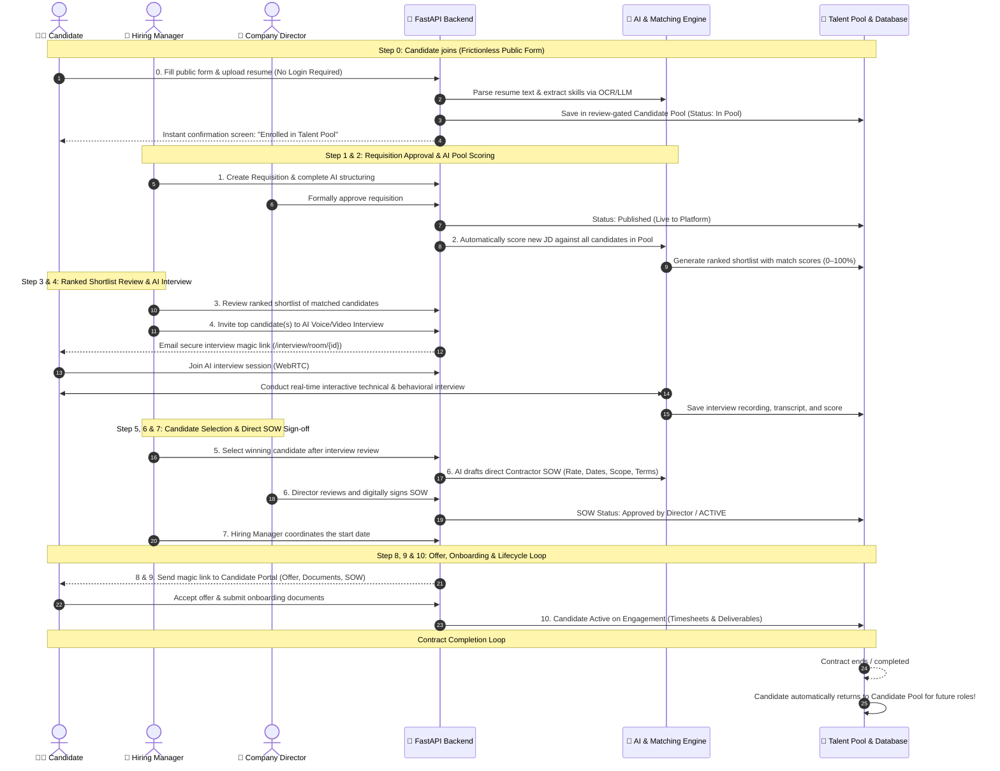
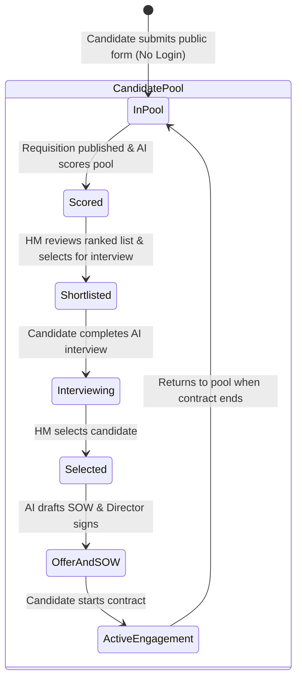

# System Architecture & Flow Diagram (Direct Talent Pool Model)

This document contains the complete system architecture, operational lifecycle, and state machine diagrams for the **TERMJOB / Bearitt** platform, reflecting the **Direct Talent Pool** architecture with no vendor intermediary.

---

## 1. High-Level System Architecture

```mermaid
graph TB
    subgraph Users ["Actors & Stakeholders"]
        CAND["🧑‍💻 Candidate (Public Applicant)"]
        HM["👔 Hiring Manager"]
        DIR["👑 Company Director"]
        SA["🛡️ Super Admin (Governance & AI Auditing)"]
    end

    subgraph Frontend ["Frontend Web Application (React + Vite + Tailwind)"]
        direction TB
        UI_FORM["Public Candidate Join Form (/join/candidate)<br/>• No login required, instant 1-click submit<br/>• Name, Email, Role, Resume Drag & Drop"]
        UI_HM["Hiring Manager Hub<br/>• Requisitions & AI Intake Structuring<br/>• Ranked Shortlist & Candidate Selection<br/>• Onboarding Coordinator"]
        UI_DIR["Director Console<br/>• Requisition Sign-off<br/>• Direct Contractor SOW Approvals"]
        UI_CAND["Candidate Magic-Link Experience<br/>• WebRTC AI Interview Room<br/>• Direct Offer & SOW Review"]
        UI_SA["Super Admin Console<br/>• AI Key Rotation & Prompt Governance<br/>• Talent Pool Quality & Audit Trail"]
    end

    subgraph Gateway ["FastAPI Backend Gateway (:8000)"]
        direction TB
        AUTH_ROUTER["/api/auth (Company RBAC & Session)"]
        REQ_ROUTER["/requisitions (Requisition Lifecycle)"]
        CAND_ROUTER["/candidates (Public Ingestion & Talent Pool)"]
        INT_ROUTER["/interview (Pipecat Live Interview Engine)"]
        WF_ROUTER["/workforce & /workorder (Direct SOW & Terms)"]
        SA_ROUTER["/api/superadmin (AI & Key Management)"]
    end

    subgraph AI_Engine ["Platform & AI Intelligence Layer"]
        GROQ["Groq LLM (Llama 3.3 / Auto Key Rotation)"]
        PIPECAT["Pipecat Audio/Video AI Pipeline"]
        WEBRTC["SmallWebRTC Media Transport"]
        OCR["Resume & CV Parser / Skill Extractor"]
        MATCHER["AI Pool Scorer (JD vs. Talent Pool)"]
    end

    subgraph Storage ["Unified Data Layer"]
        SQLITE[("SQLite (requisition.db)<br/>• Requisitions, SOWs, Direct Contracts")]
        MONGO[("MongoDB Atlas<br/>• Candidate Pool, Resumes, Transcripts<br/>• Audit Logs")]
        FS[("File System (uploads/)<br/>• Resume Documents")]
    end

    %% Flow connections
    CAND -->|Direct form submission| UI_FORM
    UI_FORM -->|POST /candidates/join (No Login)| CAND_ROUTER
    HM --> UI_HM
    DIR --> UI_DIR
    SA --> UI_SA

    UI_HM --> REQ_ROUTER
    UI_HM --> CAND_ROUTER
    UI_DIR --> REQ_ROUTER
    UI_DIR --> WF_ROUTER
    UI_CAND --> INT_ROUTER
    UI_CAND --> WF_ROUTER
    UI_SA --> SA_ROUTER

    %% AI Pipeline
    CAND_ROUTER --> OCR
    OCR --> MONGO
    REQ_ROUTER --> GROQ
    REQ_ROUTER --> MATCHER
    MATCHER --> GROQ
    MATCHER --> MONGO
    INT_ROUTER --> PIPECAT
    PIPECAT --> GROQ
    PIPECAT <--> WEBRTC
    WEBRTC <--> UI_CAND
    WF_ROUTER --> GROQ

    %% Data persistence
    AUTH_ROUTER --> SQLITE
    REQ_ROUTER --> SQLITE
    CAND_ROUTER --> MONGO
    CAND_ROUTER --> FS
    WF_ROUTER --> SQLITE
    WF_ROUTER --> MONGO
    SA_ROUTER --> MONGO
```

---

## 2. End-to-End Operational Lifecycle Flow (Direct Candidate Pool)



---

## 3. Requisition & Talent Pool State Machine


