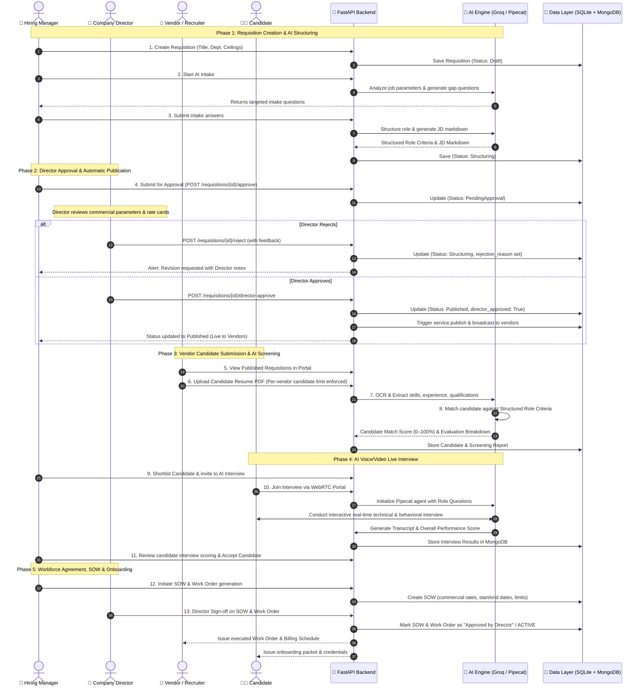
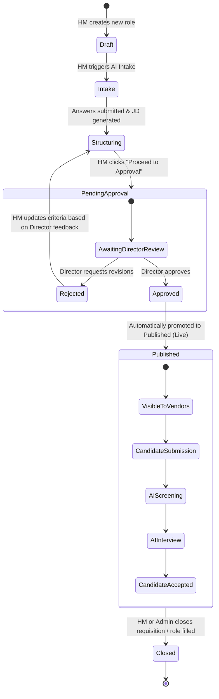

# System Architecture & Flow Diagram

This document contains the complete system architecture, end-to-end business flow, and lifecycle state machine diagrams for the **TERMJOB / Bearitt** platform.

---

## 1. High-Level System Architecture

```mermaid
graph TB
    subgraph Users ["Actors & Client Roles"]
        HM["👔 Hiring Manager"]
        DIR["👑 Company Director"]
        REC["🏢 Vendor / Recruiter"]
        CAND["🧑‍💻 Candidate"]
        SA["🛡️ Super Admin"]
    end

    subgraph Frontend ["Frontend Web Application (React + Vite + Tailwind)"]
        direction TB
        UI_AUTH["Auth Context & Session Guard (JWT / RBAC)"]
        UI_HM["Hiring Manager Portal<br/>• Requisition Intake & AI Refinement<br/>• Pipeline & Shortlisted Candidates"]
        UI_DIR["Director Dashboard<br/>• Requisition Approvals<br/>• Agreements (MSA/SOW)<br/>• Work Orders"]
        UI_REC["Vendor & Recruiter Portal<br/>• Requisition Feed<br/>• Candidate Submission & Billing Breakdown"]
        UI_CAND["Candidate Real-Time Portal<br/>• WebRTC AI Interview Room<br/>• Status Tracking"]
        UI_SA["Super Admin Console<br/>• Multi-Tenant Administration<br/>• LLM Keys & System Diagnostics"]
    end

    subgraph Gateway ["FastAPI Application Gateway (:8000)"]
        direction TB
        CORS["CORS & Request Middleware"]
        AUTH_ROUTER["/api/auth (Identity & Multi-Tenancy)"]
        REQ_ROUTER["/requisitions (Requisition Engine)"]
        CAND_ROUTER["/api/candidates (Candidate Ingestion & Matching)"]
        INT_ROUTER["/interview (Pipecat / Real-Time Interview)"]
        WF_ROUTER["/workforce & /workorder (SOW, MSA, Billing)"]
        SA_ROUTER["/api/superadmin (Agent & System Diagnostics)"]
    end

    subgraph AI_Engine ["AI & Real-Time Intelligence Engine"]
        GROQ["Groq LLM (Llama 3.3 / Multi-Key Rotation)"]
        PIPECAT["Pipecat Real-Time AI Audio/Video Pipeline"]
        WEBRTC["SmallWebRTC Media Transport"]
        OCR["Resume & CV Parser / Semantic Extractor"]
    end

    subgraph Storage ["Persistence & Data Stores"]
        SQLITE[("SQLite (requisition.db)<br/>• Requisitions, Structured Roles<br/>• Tenants, Users, Models")]
        MONGO[("MongoDB Atlas<br/>• Resumes, Live Sync<br/>• System Logs, Interview Transcripts")]
        FS[("File System (uploads/)<br/>• Candidate Resumes & Documents")]
    end

    %% User to Frontend Mappings
    HM --> UI_AUTH
    DIR --> UI_AUTH
    REC --> UI_AUTH
    CAND --> UI_AUTH
    SA --> UI_AUTH

    UI_AUTH --> UI_HM
    UI_AUTH --> UI_DIR
    UI_AUTH --> UI_REC
    UI_AUTH --> UI_CAND
    UI_AUTH --> UI_SA

    %% Frontend to API
    UI_HM -->|REST API| REQ_ROUTER
    UI_DIR -->|REST API| REQ_ROUTER
    UI_DIR -->|REST API| WF_ROUTER
    UI_REC -->|REST API| CAND_ROUTER
    UI_REC -->|REST API| WF_ROUTER
    UI_CAND -->|WebRTC + REST| INT_ROUTER
    UI_SA -->|REST API| SA_ROUTER
    UI_AUTH -->|REST API| AUTH_ROUTER

    %% Gateway to Modules
    Gateway --> REQ_ROUTER
    Gateway --> CAND_ROUTER
    Gateway --> INT_ROUTER
    Gateway --> WF_ROUTER
    Gateway --> SA_ROUTER

    %% Modules to AI Engine
    REQ_ROUTER -->|Intake Questions & JD Generation| GROQ
    CAND_ROUTER -->|Resume Text Extraction| OCR
    CAND_ROUTER -->|Scoring & Semantic Eval| GROQ
    INT_ROUTER -->|Conversational Agent| PIPECAT
    PIPECAT -->|LLM Prompts & Responses| GROQ
    PIPECAT <-->|Live Media Streaming| WEBRTC
    WEBRTC <-->|Audio/Video Stream| UI_CAND

    %% Modules to Data Layer
    AUTH_ROUTER --> SQLITE
    REQ_ROUTER --> SQLITE
    REQ_ROUTER --> MONGO
    CAND_ROUTER --> SQLITE
    CAND_ROUTER --> MONGO
    CAND_ROUTER --> FS
    INT_ROUTER --> MONGO
    WF_ROUTER --> SQLITE
    WF_ROUTER --> MONGO
    SA_ROUTER --> MONGO
```

---

## 2. End-to-End Operational Lifecycle & Sequence Flow

---

## 3. Requisition State Machine Lifecycle

---

## 4. Component Directory & Responsibilities

| Layer | Primary Tech | Key Files / Modules | Core Responsibility |
| :--- | :--- | :--- | :--- |
| **Frontend** | React 18, Vite, Tailwind CSS, Lucide | `src/pages/requisitions/*` `src/pages/Director*` `src/pages/candidates/*` | Provides dedicated role-based portals for Hiring Managers, Directors, Vendors, Candidates, and Admins. |
| **API Gateway** | FastAPI, Python 3.12 | `backend/main.py` `backend/modules/identity/*` | Route handling, authentication/JWT verification, multi-tenant workspace scoping, rate card checks. |
| **Requisition Core** | SQLAlchemy, Pydantic | `backend/modules/requisition/*` | State machine management, question generation, JD assembly, publication triggers. |
| **AI Resume Screener** | Groq LLM, OCR/PDF parsing | `backend/modules/resume_screener/*` `backend/modules/candidate_screening_agent/*` | Extracts text from CVs, matches against structured role specs, and calculates objective match scores. |
| **AI Interview Engine** | Pipecat, SmallWebRTC | `backend/modules/interview/*` | Real-time conversational voice/video interviewing, dynamic follow-up questioning, transcript scoring. |
| **Workforce & Agreements** | SQLAlchemy, MongoDB | `backend/modules/workforce/*` `backend/modules/workorder/*` | Statements of Work (SOW), Master Service Agreements (MSA), Director digital signatures, vendor billing. |
| **Persistence** | SQLite + MongoDB Atlas | `backend/modules/shared/db.py` `backend/requisition.db` | Dual-persistence engine: SQLite for relational transactional consistency; MongoDB for document sync and search. |
