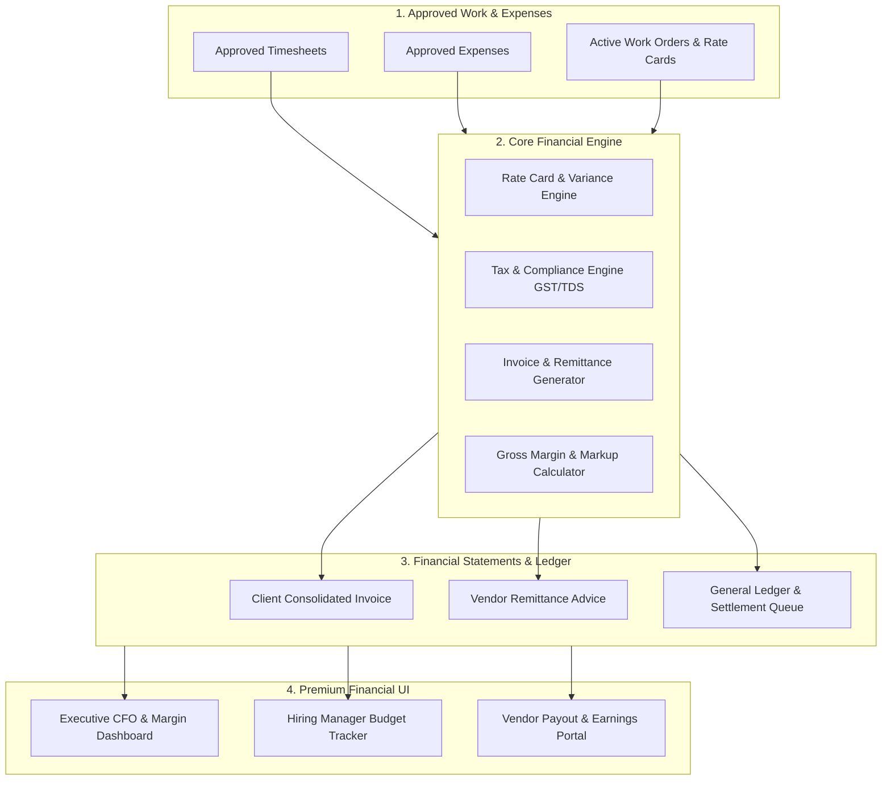
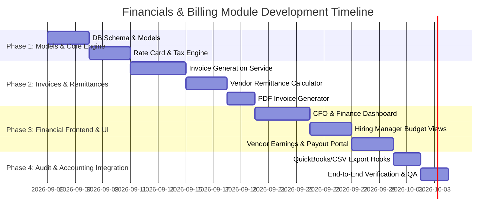

# 💳 Financials & Billing Module Architecture & Technical Roadmap
**TermJobs — Enterprise Vendor Management System (VMS) & Contractor Talent Marketplace**

---

## Executive Overview

The **Financials & Billing Module** forms the monetary backbone of TermJobs. It bridges the gap between approved contractor timesheets/expenses and financial settlement across three primary stakeholders:

1. **Buyer Enterprises (Hiring Managers, Directors, CFOs)**: Automated consolidated invoicing, budget vs. actual variance tracking, rate ceiling guardrails, and departmental spend analytics.
2. **Vendor Consultancies (Recruiters & Agency Partners)**: Automated self-billed remittance statements, vendor payout schedules, platform fee commission deductions, and tax compliance statements (GST & TDS).
3. **TermJobs Platform (Super Admin & Finance Team)**: Automated margin calculation, platform revenue tracking, payment reconciliation, and direct integrations with accounting software (QuickBooks, Xero, Tally, Stripe, Razorpay).

---

## Architecture Overview & Data Flow



---

## Key Features & Detailed Functional Modules

### 1. Commercial Terms & Rate Card Governance
- **Multi-Rate Tiers**:
  - **Contractor Pay Rate**: Rate paid to contractor/agency per hour/day.
  - **Internal Ceiling Rate**: Maximum budget allocated by Hiring Manager / Director.
  - **Vendor Display Band**: Min-Max range visible to partner vendors.
  - **Platform Bill Rate**: Final rate billed to Buyer Enterprise (including TermJobs platform margin).
- **Overtime & Multipliers**:
  - Standard (1.0x), Overtime (1.5x), Weekend/Holiday (2.0x).
- **Rate Variance Guardrails**:
  - Auto-flagging when approved candidate rates exceed company rate-card caps; routing for Director/CFO approval before work order execution.
- **Multi-Currency Engine**:
  - Support for INR (₹), USD ($), EUR (€), GBP (£) with historical exchange rate snapshotting per invoice cycle.

---

### 2. Automated Client Invoicing Engine (Buyer Side)
- **Billing Cycles**: Weekly, Bi-weekly, Monthly consolidation per Buyer Enterprise or Department.
- **Invoice Items**:
  - Itemized contractor billable hours by Work Order / Requisition.
  - Approved reimbursable expenses with attached digital receipt evidence.
  - Applicable Taxes (CGST/SGST/IGST or VAT/Sales Tax).
- **Invoice Lifecycle**:
  `Draft` $\rightarrow$ `Pending Internal Finance Approval` $\rightarrow$ `Issued to Client` $\rightarrow$ `Partially Paid` $\rightarrow$ `Paid` / `Overdue` $\rightarrow$ `Reconciled`.
- **Automated PDF Invoices**: Premium branded PDF generation with QR payment codes and line-item breakdowns.

---

### 3. Vendor Remittance & Self-Billing Engine (Vendor Consultancy Side)
- **Automated Remittance Advice (RCTI / Reverse Invoicing)**:
  - Generates vendor settlement advice at the end of each billing cycle without requiring manual invoice creation by agency partners.
- **Commission & Fee Deductions**:
  - Automatic calculation and subtraction of TermJobs platform fee percentage (e.g., 5% - 15%) from gross vendor billing.
- **Tax Compliance & Withholding**:
  - **TDS Deduction (India)**: Auto-calculation of Section 194C / 194J tax withholding with downloadable quarterly Form 16A certificates.
  - **GST Invoicing**: Support for Reverse Charge Mechanism (RCM) or vendor GST credit matching.

---

### 4. Expense Reimbursement Workflow
- **Two-Tier Expense Approval**:
  1. **Hiring Manager Review**: Validates business necessity and project relevance.
  2. **Finance Audit**: Validates tax receipts, ceiling compliance, and billable status.
- **Categorization**: Travel, Lodging, Meals, Software Licenses, Client-Site Transit, Equipment.

---

### 5. Financial Analytics & CFO Command Center
- **Gross Margin & Net Yield Tracking**: Real-time margin dollar amount and percentage per requisition, vendor, and department.
- **Budget vs. Actual Variance Gauge**: Visual alert when active contractor run-rate approaches or exceeds original requisition budget reference.
- **Days Sales Outstanding (DSO) & Aging Summary**: 0-30 days, 31-60 days, 61-90 days, 90+ days aging reports for finance teams.

---

## Technical Data Models (MongoDB Schemas)

### `Invoices` Collection
```json
{
  "id": "inv_8f9a2b1c",
  "invoice_number": "INV-2026-09-001",
  "tenant_id": "tenant_sdc_lim",
  "company_profile_id": "cp_eng_01",
  "billing_period": {
    "start_date": "2026-09-01",
    "end_date": "2026-09-15"
  },
  "status": "ISSUED", // DRAFT, ISSUED, PAID, OVERDUE, CANCELLED
  "currency": "INR",
  "subtotal": 450000.00,
  "tax_amount": 81000.00, // GST 18%
  "total_amount": 531000.00,
  "due_date": "2026-10-15",
  "paid_amount": 0.00,
  "line_items": [
    {
      "work_order_id": "wo_9921",
      "candidate_name": "Rohan Sharma",
      "requisition_title": "Senior React Developer",
      "hours_billed": 160.0,
      "hourly_rate": 2500.00,
      "amount": 400000.00,
      "timesheet_ids": ["ts_001", "ts_002"]
    },
    {
      "type": "EXPENSE",
      "description": "Travel & Client Onsite Reimbursables",
      "amount": 50000.00,
      "expense_ids": ["exp_102"]
    }
  ],
  "created_at": "2026-09-16T00:00:00Z"
}
```

### `VendorRemittances` Collection
```json
{
  "id": "rem_3c4d5e6f",
  "remittance_number": "REM-VEND-2026-09-01",
  "vendor_tenant_id": "tenant_talent_hunt",
  "client_tenant_id": "tenant_sdc_lim",
  "billing_period": {
    "start_date": "2026-09-01",
    "end_date": "2026-09-15"
  },
  "gross_amount": 400000.00,
  "platform_fee_pct": 10.0,
  "platform_fee_amount": 40000.00,
  "tds_deduction_pct": 10.0,
  "tds_amount": 40000.00,
  "gst_amount": 72000.00,
  "net_payout_amount": 392000.00,
  "status": "PROCESSING", // PENDING, PROCESSING, PAID
  "payout_reference": "UTR_9920192019",
  "paid_at": null
}
```

---

## API Endpoints Architecture

| Method | Endpoint | Description | Auth Scopes |
|---|---|---|---|
| `GET` | `/api/financials/overview` | Executive KPI metrics (Margin, Spend, DSO, Aging) | CFO, Admin, Director |
| `GET` | `/api/financials/invoices` | List consolidated client invoices with status filters | Finance, Admin, HM |
| `POST` | `/api/financials/invoices/generate` | Trigger automated invoice generation for period | Finance, System Cron |
| `GET` | `/api/financials/invoices/{id}/pdf` | Download branded PDF invoice statement | All Authorized Roles |
| `GET` | `/api/financials/vendor-remittances` | List vendor payout statements & remittance vouchers | Vendor Admin, Finance |
| `POST` | `/api/financials/remittances/{id}/payout` | Mark vendor remittance as disbursed/settled | Finance, Admin |
| `GET` | `/api/financials/expenses` | Audit queue for candidate reimbursable expenses | Finance, HM |
| `POST` | `/api/financials/expenses/{id}/audit` | Finance audit approval/rejection of expense receipt | Finance |
| `GET` | `/api/financials/export` | Export ledger data (CSV / JSON for QuickBooks / Tally) | Finance |

---

## Phase-by-Phase Implementation Plan



### **Phase 1: Backend Domain Models & Financial Logic Engine (Days 1–5)**
- Build `Invoice`, `VendorRemittance`, `TaxRate`, and `FinancialLedger` domain models in Python/FastAPI (`backend/modules/financials`).
- Implement Tax Engine (GST calculation, TDS calculation, multi-currency handling).
- Build Rate Variance & Margin calculation helpers.

### **Phase 2: Invoicing & Remittance Services (Days 6–10)**
- Create automated aggregation service to convert approved `Timesheets` + `Expenses` $\rightarrow$ `Invoices`.
- Implement Vendor Self-Billing / Remittance generator with automated commission & TDS withholding calculation.
- Integrate PDF generation library (`ReportLab` or HTML-to-PDF template renderer) for high-precision invoice PDFs.

### **Phase 3: Premium UI & Dashboards (Days 11–17)**
- **Executive CFO Dashboard (`CFOFinancials.jsx`)**:
  - Revenue, Net Profit Margin, Accounts Receivable aging chart, Top Vendor Spend chart.
- **Hiring Manager Spend Tracker (`HMFinancials.jsx`)**:
  - Requisition budget utilization gauges, contractor burn rates, ceiling variance warnings.
- **Vendor Remittance Portal (`VendorFinancials.jsx`)**:
  - Vendor earnings, payout status tracking, downloadable tax invoices & TDS certificates.

### **Phase 4: Accounting Integrations & Verification (Days 18–20)**
- CSV / JSON export engine formatted for QuickBooks, Xero, and Tally ERP.
- Comprehensive unit tests (`pytest modules/financials/tests`) and end-to-end integration tests.

---

## Design Aesthetic & UI Specification

- **Color Palette**: Dark slate blue/gray (`#0f172a`), emerald accents (`#10b981` for earnings/margins), amber alerts (`#f59e0b` for variance), and crisp high-contrast cards.
- **Typography**: Inter / Outfit with clear monospace font styling for currency amounts (`₹4,50,000.00`).
- **Interactive Widgets**:
  - Animated Budget Utilization Gauges.
  - Interactive Invoice Preview Modal.
  - One-click PDF Export and CSV Export buttons.
