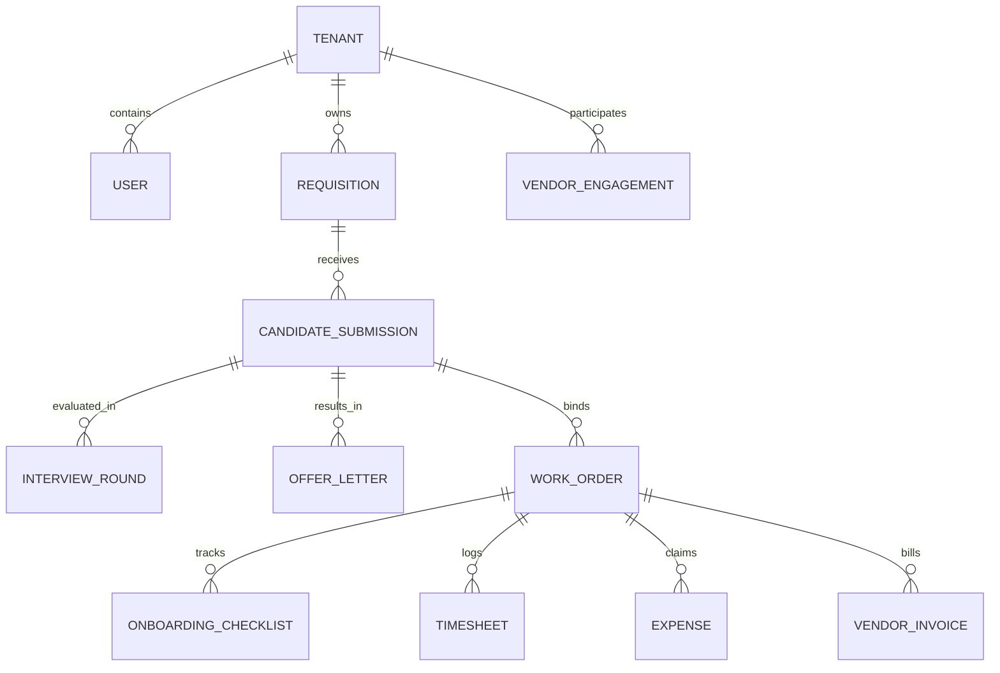
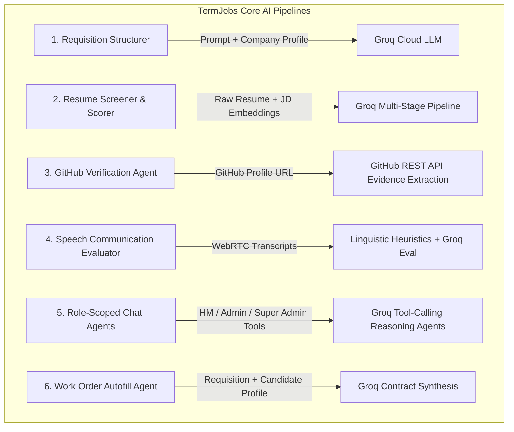

# TERMJOBS — COMPLETE SYSTEM DISCOVERY & FUNCTIONAL SPECIFICATION MAP

> **Classification:** Comprehensive Functional Ground Truth for Beacon AI QA Automation  
> **Source Repository:** `Term-Jobs` (Frontend: React 19 + Vite 6 / Backend: FastAPI 0.115+ + MongoDB Atlas)  
> **Audit Methodology:** 100% Static Codebase & Route Inspection (First-Principles Architectural Trace)  
> **Version:** 2.0.0 — Production Reference  

---

# 1. EXECUTIVE SUMMARY & SYSTEM OVERVIEW

### What TermJobs Is
**TermJobs** is an enterprise-grade contract staffing, requisition management, and workforce operating platform designed to automate the entire lifecycle of temporary, contract-to-hire, and statement-of-work (SOW) talent. The platform bridges **Client Buyer Enterprises** (companies seeking specialized technical contractors), **Vendor Consultancies / Staffing Agencies** (talent suppliers), and **Independent Candidates / Contractors**.

### Primary Users & Roles
The application implements 10 distinct system roles spanning 8 core functional portals:
1. **Super Admin**: Platform owner managing enterprise client accounts, staffing agency configurations, system-wide candidate pools, and automated AI candidate outreach.
2. **Company Admin**: Enterprise client administrator managing internal hiring managers, directors, procurement officers, finance teams, and approved partner vendor relationships.
3. **Hiring Manager**: Departmental manager responsible for initiating job requisitions, reviewing candidate shortlists, conducting video interviews, and approving workforce timesheets/expenses.
4. **Director / Executive**: C-suite / VP-level executive holding commercial approval authority over high-value requisitions, contractor work orders, and vendor master service agreements.
5. **Vendor / Recruiter**: Staffing agency partner sourcing, screening, and submitting candidates against published client requisitions, managing agreements, and tracking contractor billable hours.
6. **Procurement**: Enterprise buyer team managing Statements of Work (SOW), commercial rate cards, contractor overtime rules, and vendor contract compliance.
7. **Finance**: Corporate accounting department managing vendor invoice reconciliation, contractor payment disbursements, and expense auditing.
8. **Candidate / Contractor**: Job seeker / hired worker managing applications, offer letter signatures, onboarding equipment checklists, daily work attendance, weekly timesheets, and expense claims.
9. **Interviewer / Staff**: Technical evaluation panelist conducting live video interviews, grading candidate competencies, and reviewing AI speech analytics.
10. **HR**: Enterprise human resources personnel tracking workforce onboarding pipelines and rate card variances.

### Primary Business Workflows
1. **Requisition Structuring & Multi-Tier Approval**: HM drafts role -> AI agent auto-enriches skills & rates -> Director approves -> Published to engaged vendors with a 48-hour sourcing window.
2. **AI Resume Screening & Ranking**: Vendors upload candidate resumes -> Multi-stage AI pipeline parses text, evaluates GitHub commits/evidence, computes semantic relevance, and classifies candidate suitability.
3. **Automated 48-Hour Shortlisting & Instant Dispatch**: System queues candidate submissions, ranks top contenders via deterministic scoring, and dispatches shortlists automatically after 48h or instantly on recruiter demand.
4. **Live WebRTC Interviewing & Speech Analytics**: Candidates and interviewers enter an encrypted WebRTC room (LiveKit) with automated live transcription, linguistic heuristic analysis (WPM, filler words, vocabulary diversity), and AI competency evaluation.
5. **Hiring Decision, Offer Generation & E-Sign**: HM accepts candidate -> System generates an editable formal offer letter -> Dispatched to candidate for cryptographic/clickwrap acceptance.
6. **Work Order & SOW Provisioning**: Vendor and Client negotiate commercial rates -> Procurement validates rate caps -> Director executes work order -> Active contractor created.
7. **Onboarding & Offboarding Lifecycle**: Candidate verifies PAN/Aadhaar/Bank details, clears background verification (BGV), requests equipment -> Automated access expiry on project offboarding.
8. **Workforce Management**: Candidate logs daily hours with 0.5h step increments -> HM reviews and approves/rejects -> Vendor generates monthly invoice -> Finance processes payment.

---

# 2. REPOSITORY & TECHNICAL ARCHITECTURE

### 2.1 Technology Stack Matrix

| Layer | Component | Technology / Library | Version / Details | Source Location |
|---|---|---|---|---|
| **Frontend Framework** | Core SPA | React | `^19.0.0` | `frontend/package.json` |
| **Frontend Tooling** | Build & Dev Server | Vite | `^6.2.0` | `frontend/vite.config.js` |
| **Client Routing** | SPA Router | `react-router-dom` | `^7.2.0` (BrowserRouter) | `frontend/src/App.jsx` |
| **Styling & UI** | CSS & Utilities | TailwindCSS + Vanilla CSS | `tailwindcss: ^3.4.17` | `frontend/src/index.css` |
| **UI Components** | Icons & Motions | Lucide React + Framer Motion | `lucide-react: ^0.475.0`, `framer-motion: ^12.4.7` | `frontend/src/components` |
| **Media / WebRTC** | Live Video Rooms | LiveKit Client SDK | `livekit-client: ^2.9.1` | `frontend/src/interview` |
| **Speech Analytics** | Voice Activity Detection | VAD React | `@ricky0123/vad-react: ^0.0.7` | `frontend/src/pages/HiringManagerChat.jsx` |
| **Backend Framework** | Asynchronous API | FastAPI | `>=0.115.0` | `backend/main.py` |
| **Python Runtime** | Dependency Manager | `uv` / Python 3.11+ | `pyproject.toml` | `backend/pyproject.toml` |
| **Server Engine** | ASGI Server | Uvicorn (standard) | `>=0.32.0` | `backend/main.py` |
| **Primary Database** | Document Store | MongoDB Atlas / Local MongoDB | `pymongo>=4.9.0`, `motor>=3.6.0` | `backend/modules/shared/db.py` |
| **ORM / Session Layer** | Custom SQLAlchemy-like ODM | PyMongo Session Abstraction | Native custom class `Session` | `backend/modules/shared/db.py` |
| **LLM Provider** | Inference Engine | Groq Cloud API | `groq>=0.11.0` (LLaMA 3.3 70B Versatile) | `backend/modules/shared/config.py` |
| **Bot Integrations** | Messaging Daemons | Python Telegram Bot | `python-telegram-bot>=21.6` | `backend/modules/candidate/telegram_service.py` |
| **Document Parsing** | PDF / DOCX Ingestion | PyMuPDF (fitz), PyPDF, Python-docx | `pymupdf>=1.24.0`, `pypdf>=5.0.0` | `backend/modules/resume_screener/pipeline` |

### 2.2 Frontend Directory Structure

```text
frontend/src/
├── App.jsx                     # Master route table, role guards, lazy loaders
├── main.jsx                    # Vite React 19 bootstrap mount
├── index.css                   # Design tokens, themes, global typography
├── api/
│   └── client.js               # Central request client, SWR cache, JWT interceptor
├── context/
│   ├── AuthContext.jsx         # Master user session, tenant scope, JWT storage
│   └── CandidateAuthContext.jsx# Candidate profile auth, Google OAuth, application sync
├── components/                 # Shared UI elements (NotificationBell, Modals, SEOHead)
├── interview/                  # Standalone WebRTC & LiveKit interview module
│   ├── components/             # Video room, chat, evaluation forms, transcript viewers
│   ├── hooks/                  # LiveKit WebRTC hooks, speech transcription, media streams
│   ├── pages/                  # Candidate & Interviewer meeting rooms, HM interview hub
│   └── services/               # Interview API client (LiveKit token generator)
└── pages/                      # Page controllers organized by portal/domain
    ├── AuthPage.jsx            # Multi-portal login & register interface
    ├── DashboardLayout.jsx     # Master adaptive sidebar, navigation bar & header
    ├── LandingPage.jsx         # Public marketing homepage
    ├── OpenRolesPage.jsx       # Public searchable job board with 1-click apply
    ├── SuperAdminDashboard.jsx # Platform owner system analytics & console
    ├── AdminDashboard.jsx      # Company Admin enterprise portal
    ├── HiringManagerDashboard.jsx # Hiring Manager pipeline command center
    ├── RecruiterDashboard.jsx  # Staffing vendor candidate management hub
    ├── DirectorDashboard.jsx   # Executive overview & pending approvals
    ├── ProcurementDashboard.jsx# Commercial SOW & rate card negotiation
    ├── FinanceDashboard.jsx    # Work order invoice clearing & contractor payouts
    ├── candidates/             # Candidate management (Shortlisted, Onboarding, Issues)
    ├── recruiter/              # Recruiter agreements, interviews & billing
    ├── requisitions/           # Requisition overview, 6-tab editor, detail views
    └── workforce/              # Team rosters, timesheet approval, expense verification
```

### 2.3 Backend Directory Structure

```text
backend/
├── main.py                     # App entry point, CORS, routers, background workers
├── pyproject.toml              # Project dependencies and packaging settings
├── uploads/                    # Temporary and persistent file storage (resumes, work orders)
├── api/
│   └── index.py                # Serverless entry point for Vercel edge deployment
└── modules/
    ├── shared/                 # Core infrastructure (MongoDB client, config, SWR cache)
    ├── identity/               # Users, tenants, vendor engagements, JWT auth services
    ├── requisition/            # Requisition models, 6-tab state machine, Groq intake
    ├── candidate/              # Candidate submissions, 48h auto-shortlisting, telegram bot
    ├── resume_screener/        # AI parsing pipeline, GitHub verification, multi-criteria scoring
    ├── interview/              # LiveKit token issuer, AI speech analytics, round scheduler
    ├── workorder/              # Work order generation, SOW contracts, e-signature uploads
    ├── onboarding/             # Equipment/credential checklists, activation gates, issue tickets
    ├── workforce/              # Contractor team roster, weekly timesheets, expense claims
    ├── billing/                # Vendor billing, overtime multipliers, invoice generator
    ├── candidate_portal/       # Contractor assignment dashboard, daily time capture
    ├── candidate_profile/      # Candidate self-registration, Google OAuth, talent pool
    ├── hm_telegram_bot/        # Dedicated Telegram bot daemon for Hiring Manager notifications
    ├── superadmin_agent/       # Voice AI agent and platform administrative agent
    ├── company_admin_agent/    # Company Admin conversational assistant
    └── hiring_manager_agent/   # Hiring Manager recruitment assistant
```

---

# 3. DATABASE / DATA MODEL SPECIFICATION

TermJobs utilizes MongoDB Atlas via a custom session abstraction layer located in `backend/modules/shared/db.py`. Models inherit from `Model` and map directly to collections.



### 3.1 Entity Catalog

#### 1. `tenants` (Collection: `tenants`)
- **Purpose**: Establishes organizational boundaries for client corporations and staffing consultancies.
- **Fields**: `id` (UUID), `name` (string), `tenant_type` (`client` | `consultancy`), `vendor_type` (`standard` | `guest`), `client_type` (`standard` | `guest`), `is_guest` (bool), `created_by_tenant_id` (string), `is_deleted` (bool), `logo_url` (string), `created_at` (datetime).
- **Access Control**: Super Admin can create/delete any tenant. Company Admin can invite/create guest vendor consultancies.

#### 2. `users` (Collection: `users`)
- **Purpose**: Master identity record for authenticated platform actors.
- **Fields**: `id` (UUID), `tenant_id` (FK -> `tenants.id`), `email` (string, unique), `name` (string), `password_hash` (bcrypt), `role` (`Super Admin`, `Admin`, `Hiring Manager`, `Director`, `Procruiter`, `Candidate`, `Procurement`, `Finance`, `HR`), `department` (string), `phone` (string), `candidate_id` (FK -> `candidate_submissions.id`), `workorder_id` (string), `candidate_limit` (int), `is_active` (bool), `is_deleted` (bool), `created_at` (datetime).
- **Access Control**: Super Admin provisions Admins & Recruiters. Company Admin provisions HMs, Directors, Procurement, and Finance.

#### 3. `requisitions` (Collection: `requisitions`)
- **Purpose**: Represents an open contractor job demand.
- **Fields**: `id` (UUID), `tenant_id` (FK), `company_profile_id` (FK), `created_by` (FK -> `users.id`), `status` (`Draft`, `Intake`, `Structuring`, `PendingApproval`, `Published`, `Closed`), `title` (string), `structured_role` (JSON containing all 6 editor tabs), `generated_jd_markdown` (string), `vendor_candidate_limit` (int, default 1), `director_approved` (bool), `director_approved_by` (string), `director_approved_at` (datetime), `rejection_reason` (string), `shortlist_window_hours` (int, default 48), `shortlist_deadline` (datetime), `shortlist_dispatched` (bool), `created_at` (datetime), `updated_at` (datetime).

#### 4. `candidates` (Collection: `candidates`)
- **Purpose**: Central talent pool bank housing prospective candidates and raw resumes.
- **Fields**: `id` (UUID), `candidate_name` (string), `candidate_title` (string), `candidate_email` (string), `candidate_phone` (string), `vendor_company_name` (string), `skills` (list[str]), `filename` (string), `resume_pdf` (base64 string), `summary` (string), `details` (JSON), `tenant_id` (FK), `created_at` (datetime).

#### 5. `candidate_submissions` (Collection: `candidate_submissions`)
- **Purpose**: An official candidate profile submitted by a recruiter or applicant against a specific requisition.
- **Fields**: `id` (UUID), `requisition_id` (FK -> `requisitions.id`), `candidate_name` (string), `candidate_email` (string), `vendor_name` (string), `filename` (string), `resume_text` (string), `match_score` (float: 0-100), `recommendation` (`Shortlist`, `Review`, `Reject`), `status` (`Screened`, `Shortlisted`, `Under Review`, `Interview Requested`, `Interview Completed`, `Accepted`, `Rejected`, `Hired`), `details` (breakdown of skills, experience, education), `hiring_manager_notes` (string), `created_at` (datetime).

#### 6. `interview_rounds` (Collection: `interview_rounds`)
- **Purpose**: Schedules and stores real-time records of WebRTC video interview sessions.
- **Fields**: `id` (UUID), `round_id` (string), `tenant_id` (FK), `requisition_id` (FK), `candidate_submission_id` (FK), `candidate_name` (string), `candidate_email` (string), `round_number` (int), `round_name` (string), `round_type` (`Technical`, `Cultural`, `Executive`), `scheduled_date` (string), `scheduled_time` (string), `duration_minutes` (int), `interviewer_name` (string), `candidate_passcode` (string), `candidate_token` (UUID), `room_id` (string), `status` (`Scheduled`, `In Progress`, `Completed`, `Cancelled`, `No Show`), `evaluation` (JSON scores and verdicts), `transcript` (list of speaker turns), `communication_metrics` (JSON: WPM, filler count, vocabulary diversity), `communication_analysis` (JSON: AI qualitative score), `recording_url` (string).

#### 7. `offer_letters` (Collection: `offer_letters`)
- **Purpose**: Formal employment and contract offer document dispatched to selected candidates.
- **Fields**: `candidate_id` (string), `submission_id` (string), `company_name` (string), `candidate_name` (string), `candidate_email` (string), `job_title` (string), `offer_date` (string), `joining_date` (string), `contract_period` (string), `annexure` (JSON breakdown: Basic, HRA, Other allowances, PF, Total CTC), `status` (`Draft`, `Offer Extended`, `Signed`, `Declined`), `agreement_status` (`Pending Signature`, `Signed`).

#### 8. `work_orders` (Collection: `work_orders`)
- **Purpose**: Legally binding procurement contract executed between Buyer Enterprise and Vendor Agency for an active contractor.
- **Fields**: `id` (UUID), `workorder_id` (string), `requisition_id` (FK), `candidate_id` (FK), `candidate_name` (string), `candidate_email` (string), `vendor_id` (FK), `vendor_name` (string), `company_name` (string), `hiring_manager_name` (string), `job_title` (string), `billing_rate` (float), `rate_type` (`hourly` | `daily` | `monthly`), `currency` (`INR`), `billing_cycle` (`Monthly`), `payment_terms` (`NET 30`), `status` (`Draft`, `Submitted`, `Pending Director Approval`, `ACTIVE`, `Revision Requested`, `TERMINATED`), `esign_document_url` (string), `approval_type` (`click_to_approve` | `esign`).

#### 9. `onboarding_checklists` (Collection: `onboarding_checklists`)
- **Purpose**: Tracks operational setup and compliance gates before a contractor begins work.
- **Fields**: `candidate_id` (FK), `workorder_id` (string), `laptop_required` (bool), `laptop_spec` (string), `badge_required` (bool), `activation_gates` (list of gates: `pan_aadhaar_bank`, `nda_ip`, `pf_esic`, `bgv`, `ad_vpn_badge`, `site_safety`, `laptop`, `manager_orientation`), `software` (list), `training` (list), `completed_items` (dict of ID -> bool), `status` (`not_started`, `in_progress`, `completed`).

#### 10. `timesheets` (Collection: `timesheets`)
- **Purpose**: Weekly contractor time capture entries submitted for managerial review.
- **Fields**: `id` (string), `workorder_id` (string), `candidate_id` (string), `week_start` (YYYY-MM-DD), `week_end` (YYYY-MM-DD), `entries` (array of 7 days: `{day, date, hours, category, note}`), `total_hours` (float), `regular_hours` (float), `overtime_hours` (float), `status` (`Draft`, `Submitted`, `Approved`, `Rejected`), `rejection_reason` (string), `approved_by` (string), `approved_at` (datetime).

#### 11. `expenses` (Collection: `expenses`)
- **Purpose**: Project-related out-of-pocket expense claims submitted by contractors.
- **Fields**: `id` (string), `workorder_id` (string), `candidate_id` (string), `date` (YYYY-MM-DD), `category` (`Travel`, `Meals`, `Equipment`, `Other`), `amount` (float INR), `receipt_filename` (string), `receipt_url` (string), `description` (string), `status` (`Draft`, `Submitted`, `Approved`, `Rejected`), `approved_by` (string).

#### 12. `vendor_invoices` (Collection: `vendor_invoices`)
- **Purpose**: Monthly consolidated billing statement generated by staffing agencies for client payment.
- **Fields**: `id` (string), `invoice_number` (string), `workorder_id` (string), `vendor_name` (string), `client_name` (string), `billing_period` (YYYY-MM), `total_billable_hours` (float), `gross_amount` (float), `tax_amount` (float), `total_payable` (float), `status` (`Draft`, `Submitted`, `Verified`, `Paid`, `Disputed`).

---

# 4. COMPLETE PAGE & ROUTE INVENTORY

The TermJobs application contains **42 distinct user-facing route paths** mapped across 8 distinct portal contexts.

### 4.1 Public & Unauthenticated Routes

#### 1. Page: Public Landing Page
- **Route**: `/`
- **Component**: `frontend/src/pages/LandingPage.jsx`
- **Access**: Public / Unauthenticated
- **Purpose**: Platform presentation, value propositions, and role-based login call-to-actions.
- **UI Elements**: Hero section with interactive horizontal slider, feature highlights, contractor value calculator, direct links to `/open-roles` and `/login`.

#### 2. Page: Open Roles Career Board
- **Route**: `/open-roles` (Aliases: `/openroles`, `/jobs`, `/careers`, `/apply`)
- **Component**: `frontend/src/pages/OpenRolesPage.jsx`
- **Access**: Public
- **Purpose**: Live search directory of all published requisitions across client enterprises.
- **Actions**: Filter by skill/location/seniority, view job description modal, 1-Click apply with resume upload, redirect to Candidate Profile login.
- **APIs**: `GET /api/public/requisitions`, `POST /api/public/requisitions/{id}/apply`.

#### 3. Page: Master Authentication Console
- **Route**: `/login` (Alias: `/signin`)
- **Component**: `frontend/src/pages/AuthPage.jsx`
- **Access**: Public
- **Purpose**: Single sign-on portal for all internal platform actors (Super Admin, Admin, HM, Recruiter, Director, Procurement, Finance).
- **Actions**: Email/Password login, candidate ID lookup, error toast on invalid credentials.
- **APIs**: `POST /api/auth/login`.

#### 4. Page: Candidate Profile Auth
- **Route**: `/candidate/profile-login` (Alias: `/candidate-login`)
- **Component**: `frontend/src/pages/CandidateProfileAuth.jsx`
- **Access**: Public
- **Purpose**: Candidate talent network onboarding and profile access.
- **Actions**: Email/password registration, Google OAuth sign-in, mandatory resume file attachment.
- **APIs**: `POST /api/candidate-profile/login`, `POST /api/candidate-profile/auth/google`, `POST /api/candidate-profile/register`.

#### 5. Page: Super Admin Emergency Login
- **Route**: `/admin/login`
- **Component**: `frontend/src/pages/SuperAdminLogin.jsx`
- **Access**: Public
- **Purpose**: Dedicated login terminal for platform Super Admin.
- **APIs**: `POST /api/auth/login`.

#### 6. Page: Executive Director Login
- **Route**: `/director/login`
- **Component**: `frontend/src/pages/DirectorLogin.jsx`
- **Access**: Public
- **Purpose**: Streamlined executive sign-in terminal.
- **APIs**: `POST /api/auth/login`.

#### 7. Pages: Self-Service Departmental Join Portals
- **Routes**:
  - `/join/hiring-manager` (Invite alias: `/invite/hiring-manager`)
  - `/join/director` (Invite alias: `/invite/director`)
  - `/join/procurement` (Invite alias: `/invite/procurement`)
  - `/join/finance` (Invite alias: `/invite/finance`)
- **Components**: `pages/JoinHiringManager.jsx`, `pages/JoinDirector.jsx`, `pages/JoinProcurement.jsx`, `pages/JoinFinance.jsx`.
- **Purpose**: Self-registration for invited enterprise team members with token validation.
- **APIs**: `GET /api/auth/join/company-info`, `POST /api/auth/join/{role}`.

---

### 4.2 Hiring Manager Portal Routes (`/dashboard/...`)

#### 8. Page: Hiring Manager Dashboard
- **Route**: `/dashboard/hiring-manager`
- **Component**: `frontend/src/pages/HiringManagerDashboard.jsx`
- **Access**: Role `Hiring Manager`
- **Purpose**: Executive KPI command center tracking active pipelines, critical attention items, interview status, and timesheet approvals.
- **UI Elements**: Metric counters, urgent action queue, live pipeline distribution, recent candidates table.
- **APIs**: `GET /api/workforce/stats`, `GET /api/requisitions`, `GET /api/candidates`, `GET /api/interviews/summary`.

#### 9. Page: Hiring AI Conversational Chat
- **Route**: `/dashboard/hiring-manager/chat`
- **Component**: `frontend/src/pages/HiringManagerChat.jsx`
- **Access**: Role `Hiring Manager`
- **Purpose**: Natural-language conversational interface to query pipeline data, review shortlists, and trigger actions.
- **UI Elements**: Chat message history, voice input (VAD React), text-to-speech (TTS), right-hand dynamic data widget.
- **APIs**: `POST /api/hiring-manager/agent/chat`.

#### 10. Page: Requisitions Overview
- **Route**: `/dashboard/requisitions` (Sub-tabs: `/published`, `/pending-approval`, `/drafted`, `/completed`, `/history`)
- **Component**: `frontend/src/pages/requisitions/RequisitionOverview.jsx`
- **Access**: Role `Hiring Manager`, `HR`
- **Purpose**: Tabbed master inventory of all enterprise requisitions.
- **Actions**: Search, filter by status, view requisition details, download JD, close requisition.
- **APIs**: `GET /api/requisitions`.

#### 11. Page: New Requisition Creator
- **Route**: `/dashboard/requisitions/new`
- **Component**: `frontend/src/pages/requisitions/NewRequisition.jsx`
- **Access**: Role `Hiring Manager`
- **Purpose**: Comprehensive 6-tab requisition authoring wizard.
- **Tabs**: Role Info, Engagement Setup, Commercials & Rate Cards, Work Setup & Location, Compliance & Screening, Evaluation Process.
- **Actions**: Upload JD document (auto-extract fields), run AI Requisition Structurer, save draft, submit for Director approval.
- **APIs**: `POST /api/upload/jd-document`, `POST /api/requisitions`, `POST /api/requisitions/ai-structure`.

#### 12. Page: Requisition Detail & Edit
- **Route**: `/dashboard/requisitions/:id`
- **Component**: `frontend/src/pages/requisitions/RequisitionDetail.jsx`
- **Access**: Role `Hiring Manager`, `Director`, `Admin`
- **Purpose**: Deep-dive into structured role specification, generated JD markdown, and candidates submitted.
- **Actions**: Inline edit fields, publish to vendors, approve/reject revisions, trigger shortlist generation.
- **APIs**: `GET /api/requisitions/{id}`, `PATCH /api/requisitions/{id}`, `POST /api/requisitions/{id}/approve`, `POST /api/requisitions/{id}/publish`.

#### 13. Page: Candidates Roster
- **Route**: `/dashboard/candidates`
- **Component**: `frontend/src/pages/candidates/RequisitionCandidates.jsx`
- **Access**: Role `Hiring Manager`
- **Purpose**: Candidate submission evaluation matrix.
- **UI Elements**: Match score badges, skills gap visualizer, resume drawer with base64 PDF viewer, GitHub profile inspector.
- **Actions**: Schedule interview, accept & onboard candidate, reject candidate.
- **APIs**: `GET /api/candidates`, `POST /api/candidates/shortlist`.

#### 14. Page: Live Interviews & AI Analytics
- **Route**: `/dashboard/interviews`
- **Component**: `frontend/src/interview/pages/HiringManagerInterviews.jsx`
- **Access**: Roles `Hiring Manager`, `Recruiter`, `Super Admin`, `Director`
- **Purpose**: Video interview orchestration, speech analytics, and evaluation hub.
- **UI Elements**: Active 48h shortlist countdown timer, round timelines (Round 1, 2, 3), video replay player, linguistic communication metrics (WPM, filler words), candidate decision modal.
- **Actions**: Create interview round, copy candidate meeting link, view AI transcript, Accept & Onboard candidate, Reject candidate.
- **APIs**: `GET /api/interviews/rounds`, `GET /api/interviews/summary`, `POST /api/interviews/rounds`, `POST /api/interviews/candidates/{id}/decision`.

#### 15. Page: Reported Onboarding Issues
- **Route**: `/dashboard/candidates/issues`
- **Component**: `frontend/src/pages/candidates/ReportedIssues.jsx`
- **Access**: Role `Hiring Manager`
- **Purpose**: Resolution ticketing queue for contractor onboarding blockers (hardware, VPN credentials, ID badges).
- **Actions**: Mark issue fixed/resolved, send automatic notification to candidate.
- **APIs**: `GET /api/onboarding/issues`, `POST /api/onboarding/issues/{id}/resolve`.

#### 16. Page: Portal Access Provisioning
- **Route**: `/dashboard/candidates/portal-access`
- **Component**: `frontend/src/pages/candidates/CandidatePortalAccess.jsx`
- **Access**: Role `Hiring Manager`, `Admin`
- **Purpose**: Manage candidate portal credentials and account activations.
- **Actions**: Re-send invitation email, reset password key, revoke access.
- **APIs**: `GET /api/auth/portal-users`, `POST /api/auth/portal-users`.

#### 17. Page: Team Workforce Overview
- **Route**: `/dashboard/workforce/team`
- **Component**: `frontend/src/pages/workforce/TeamOverview.jsx`
- **Access**: Role `Hiring Manager`
- **Purpose**: Roster of all active contractors currently working under this hiring manager.
- **UI Elements**: Contractor cards, project title, work order reference, billable hours to date.
- **APIs**: `GET /api/workforce/team`.

#### 18. Page: Timesheet Approval Queue
- **Route**: `/dashboard/workforce/timesheets`
- **Component**: `frontend/src/pages/workforce/TimesheetApprovals.jsx`
- **Access**: Role `Hiring Manager`
- **Purpose**: Weekly timesheet verification and sign-off.
- **UI Elements**: 7-day hours breakdown, regular vs overtime hours, contractor daily work notes.
- **Actions**: Approve timesheet, Reject timesheet with mandatory revision note.
- **APIs**: `GET /api/workforce/timesheets`, `POST /api/workforce/timesheets/{id}/approve`, `POST /api/workforce/timesheets/{id}/reject`.

#### 19. Page: Expense Approval Queue
- **Route**: `/dashboard/workforce/expenses`
- **Component**: `frontend/src/pages/workforce/ExpenseApprovals.jsx`
- **Access**: Role `Hiring Manager`
- **Purpose**: Project expense claim auditing.
- **Actions**: View attached receipts, approve claim, reject claim.
- **APIs**: `GET /api/workforce/expenses`, `POST /api/workforce/expenses/{id}/approve`, `POST /api/workforce/expenses/{id}/reject`.

---

### 4.3 Vendor / Recruiter Portal Routes (`/dashboard/recruiter/...`)

#### 20. Page: Recruiter Dashboard
- **Route**: `/dashboard/recruiter`
- **Component**: `frontend/src/pages/RecruiterDashboard.jsx` (view="dashboard")
- **Access**: Role `Recruiter`
- **Purpose**: Vendor command center tracking engaged buyer requirements, active submissions, and candidate pipeline counts.
- **APIs**: `GET /api/requisitions`, `GET /api/candidates`.

#### 21. Page: Vendor Requisitions Directory
- **Route**: `/dashboard/recruiter/requisitions`
- **Component**: `frontend/src/pages/RecruiterDashboard.jsx` (view="requisitions")
- **Access**: Role `Recruiter`
- **Purpose**: View all published client requisitions open to this vendor.
- **Actions**: Review rate bands (vendor floor/cap), submission quotas, candidate submit drawer.
- **APIs**: `GET /api/requisitions`.

#### 22. Page: Candidate Bank & Auto-Screener
- **Route**: `/dashboard/recruiter/candidates`
- **Component**: `frontend/src/pages/RecruiterDashboard.jsx` (view="candidates")
- **Access**: Role `Recruiter`
- **Purpose**: Staffing agency internal resume repository with bulk AI matching.
- **Actions**: Upload candidate resumes (.pdf/.docx), run AI Resume Screener, match against active requirements.
- **APIs**: `GET /api/candidates/bank`, `POST /api/candidates/bank/upload`, `POST /api/screen-resumes`.

#### 23. Page: Shortlisted Candidates
- **Route**: `/dashboard/recruiter/shortlisted`
- **Component**: `frontend/src/pages/RecruiterDashboard.jsx` (view="shortlisted")
- **Access**: Role `Recruiter`
- **Purpose**: Track candidates advancing to client review and interviews.
- **APIs**: `GET /api/candidates/shortlisted`.

#### 24. Page: Vendor Interview Requests
- **Route**: `/dashboard/recruiter/interviews`
- **Component**: `frontend/src/pages/recruiter/InterviewRequests.jsx`
- **Access**: Role `Recruiter`
- **Purpose**: Coordinate client interview requests and propose candidate time slots.
- **Actions**: Confirm client proposed slot, propose alternative slots.
- **APIs**: `GET /api/interviews/schedules`, `POST /api/interviews/schedules/{id}/confirm`.

#### 25. Page: Vendor Agreements
- **Route**: `/dashboard/recruiter/agreements`
- **Component**: `frontend/src/pages/recruiter/VendorAgreements.jsx`
- **Access**: Role `Recruiter`
- **Purpose**: Master Service Agreements (MSA) and executed work orders between vendor and client enterprises.
- **Actions**: Sign agreements, download executed PDF copies.
- **APIs**: `GET /api/work-orders`.

#### 26. Page: Accepted Candidates & Billing
- **Route**: `/dashboard/recruiter/accepted` (Billing tab: `/dashboard/recruiter/billing`)
- **Component**: `frontend/src/pages/RecruiterDashboard.jsx` (view="accepted") / `pages/recruiter/VendorBilling.jsx`
- **Access**: Role `Recruiter`
- **Purpose**: Contractor billing management, timesheet hour auditing, overtime multiplier calculation, and monthly invoice generation.
- **Actions**: Inspect billable hours, generate invoice, dispatch SOW billing package to client Procurement.
- **APIs**: `GET /api/vendor-billing/overview`, `POST /api/vendor-billing/invoices/generate`, `POST /api/vendor-billing/candidate/{id}/dispatch-sow`.

---

### 4.4 Company Admin Portal Routes (`/dashboard/admin/...`)

#### 27. Page: Admin Dashboard
- **Route**: `/dashboard/admin`
- **Component**: `frontend/src/pages/AdminDashboard.jsx`
- **Access**: Role `Admin`
- **Purpose**: Enterprise workspace overview tracking departments, user provisioning, and company profile.
- **APIs**: `GET /api/auth/users`, `GET /api/auth/company-profile`.

#### 28. Page: Admin AI Assistant
- **Route**: `/dashboard/admin/chat`
- **Component**: `frontend/src/pages/AiChat.jsx`
- **Access**: Role `Admin`
- **Purpose**: Enterprise management chat agent with tenant-scoped administrative tools.
- **APIs**: `POST /api/company-admin/agent/chat`.

#### 29. Pages: Departmental User Management
- **Routes**:
  - `/dashboard/admin/hiring-managers` -> `ManageHiringManagers.jsx`
  - `/dashboard/admin/directors` -> `ManageDirectors.jsx`
  - `/dashboard/admin/procurement` -> `ManageProcurement.jsx`
  - `/dashboard/admin/finance` -> `ManageFinance.jsx`
- **Access**: Role `Admin`
- **Purpose**: Provision, invite, activate, deactivate, or delete enterprise user accounts across departments.
- **Actions**: Create user (triggers welcome email with access key), edit user, approve pending join requests, delete user.
- **APIs**: `GET /api/auth/users`, `POST /api/auth/users`, `PATCH /api/auth/users/{id}`, `DELETE /api/auth/users/{id}`, `POST /api/auth/users/{id}/approve`.

#### 30. Page: Partner Vendors Management
- **Route**: `/dashboard/admin/partner-vendors` (Alias: `/dashboard/admin/vendors`)
- **Component**: `frontend/src/pages/ManagePartnerVendors.jsx`
- **Access**: Role `Admin`
- **Purpose**: Control which staffing agencies are engaged and authorized to view company job demands.
- **Actions**: Toggle vendor engagement status, set per-vendor candidate submission limits, onboard new guest vendors.
- **APIs**: `GET /api/auth/vendors`, `PUT /api/auth/vendors`, `POST /api/auth/vendors/guest`.

#### 31. Page: Company Admin Profile
- **Route**: `/dashboard/admin/profile`
- **Component**: `frontend/src/pages/CompanyAdminProfile.jsx`
- **Access**: Role `Admin`
- **Purpose**: Edit corporate identity, company logo, industry, headquarters, and tech stack tags.
- **APIs**: `GET /api/auth/company-profile`, `PUT /api/auth/company-profile`.

---

### 4.5 Executive Director Portal Routes (`/dashboard/director/...`)

#### 32. Page: Director Executive Overview
- **Route**: `/dashboard/director` (Tabs: `/overview`, `/approvals`, `/requisitions`)
- **Component**: `frontend/src/pages/DirectorDashboard.jsx`
- **Access**: Role `Director`
- **Purpose**: Executive oversight of pending commercial approvals, active headcounts, and departmental requisitions.
- **APIs**: `GET /api/requisitions`, `GET /api/work-orders/director-agreements`.

#### 33. Page: Director Work Orders Approval
- **Route**: `/dashboard/director/work-orders`
- **Component**: `frontend/src/pages/DirectorWorkOrders.jsx`
- **Access**: Role `Director`
- **Purpose**: Authoritative sign-off on contractor work orders.
- **Actions**: Approve work order (status -> `ACTIVE`), request revision with notes, reject work order.
- **APIs**: `GET /api/workforce/director/work-orders`, `POST /api/work-orders/{id}/approve`, `POST /api/work-orders/{id}/request-revision`.

#### 34. Page: Director Master Agreements
- **Route**: `/dashboard/director/agreements`
- **Component**: `frontend/src/pages/DirectorAgreements.jsx`
- **Access**: Role `Director`
- **Purpose**: Executive review and sign-off on vendor contractual agreements.
- **APIs**: `GET /api/work-orders/director-agreements`.

---

### 4.6 Procurement & Finance Portals

#### 35. Page: Procurement SOW Dashboard
- **Route**: `/dashboard/procurement` (Alias: `/dashboard/procurement/sow`)
- **Component**: `frontend/src/pages/ProcurementDashboard.jsx`
- **Access**: Roles `Procurement`, `Procurement Team`
- **Purpose**: Audit and adjust Statements of Work (SOW), buyer charge rates, worker pay rates, overtime multipliers (1.5x), and payment terms (NET 30).
- **Actions**: Cross-check terms, request revisions from vendor, submit to Director for final sign-off.
- **APIs**: `GET /api/workforce/procurement/sow-agreements`, `PUT /api/workforce/procurement/sow-agreements/{id}`.

#### 36. Page: Finance Work Orders & Payments
- **Route**: `/dashboard/finance` (Alias: `/dashboard/finance/work-orders`)
- **Component**: `frontend/src/pages/FinanceDashboard.jsx`
- **Access**: Roles `Finance`, `Finance Team`
- **Purpose**: Reconcile contractor billing, verified timesheets, and execute payment disbursements.
- **Actions**: Process payment (NEFT/RTGS, Cheque, Wire), record transaction reference number, generate payment voucher.
- **APIs**: `GET /api/workforce/finance/work-orders`, `POST /api/workforce/finance/work-orders/{id}/record-payment`.

---

### 4.7 Super Admin Portal Routes (`/dashboard/superadmin/...`)

#### 37. Page: Super Admin Dashboard
- **Route**: `/dashboard/superadmin`
- **Component**: `frontend/src/pages/SuperAdminDashboard.jsx`
- **Access**: Role `Super Admin`
- **Purpose**: High-level system vitals, total tenant counts, active candidate counts, database connectivity metrics.
- **APIs**: `GET /api/superadmin/agent/stats`, `GET /api/health`.

#### 38. Page: Super Admin AI Console
- **Route**: `/dashboard/superadmin/chat`
- **Component**: `frontend/src/pages/AiChat.jsx`
- **Access**: Role `Super Admin`
- **Purpose**: System-wide administrative assistant with unrestricted tool execution.
- **APIs**: `POST /api/superadmin/agent/chat`.

#### 39. Page: Super Admin Candidate Pool
- **Route**: `/dashboard/superadmin/candidates` (Aliases: `/candidate-pool`, `/candidatepool`)
- **Component**: `frontend/src/pages/SuperAdminCandidatePool.jsx`
- **Access**: Role `Super Admin`
- **Purpose**: Global platform talent repository combining public applicants and vendor candidate banks.
- **Actions**: Search by skill/title, view full resume PDF, delete candidates.
- **APIs**: `GET /api/superadmin/candidate-pool`, `POST /api/superadmin/candidate-pool`, `DELETE /api/superadmin/candidate-pool/{id}`.

#### 40. Page: Super Admin Candidate Management & Billing
- **Route**: `/dashboard/superadmin/candidate-management` (Billing tab: `?tab=billing`)
- **Component**: `frontend/src/pages/SuperAdminCandidateManagement.jsx`
- **Access**: Role `Super Admin`
- **Purpose**: Oversight of candidate selections, offer letter status, and global billing reconciliation.
- **APIs**: `GET /api/superadmin/candidate-management`.

#### 41. Page: AI Email & Telegram Outreach Control
- **Route**: `/dashboard/superadmin/outreach`
- **Component**: `frontend/src/pages/SuperAdminOutreachControl.jsx`
- **Access**: Role `Super Admin`
- **Purpose**: Control automated talent matching and 1-click email/Telegram notifications.
- **Actions**: Toggle auto-outreach daemon, manually trigger Top 20 candidate match for a requisition, send test Telegram alerts.
- **APIs**: `GET /api/superadmin/outreach/stats`, `GET /api/superadmin/outreach/requisitions`, `POST /api/superadmin/outreach/trigger/{id}`.

---

### 4.8 Candidate Portal & Meeting Room Routes

#### 42. Page: Candidate Portal Dashboard
- **Route**: `/candidate/dashboard` (Aliases: `/dashboard/candidate`, `/candidate/portal`, `/candidate/assignment`, `/candidate/timesheet`, `/candidate/attendance`)
- **Component**: `frontend/src/pages/candidates/CandidatePortal.jsx`
- **Access**: Role `Candidate` (or authenticated Candidate Profile)
- **Purpose**: Contractor operational workspace.
- **Tabs**:
  - `Dashboard`: Weekly time capture meter, active assignment summary.
  - `Assignment`: Contract dates, client enterprise details, manager contact, rate terms.
  - `Timesheet`: 7-day weekly time logging with 0.5h stepper (+/-), categories, task notes, submission.
  - `Attendance`: Monthly calendar attendance verification (Present, Leaves, Holidays).
  - `Expenses`: Out-of-pocket project reimbursement claims with receipt upload.
- **Modals**: Offboarding clearance countdown, raise blocker ticket to Hiring Manager.
- **APIs**: `GET /api/candidate-portal/assignment`, `GET /api/candidate-portal/timesheet`, `POST /api/candidate-portal/timesheet`, `POST /api/candidate-portal/issues`.

#### 43. Page: WebRTC Live Interview Room
- **Route**: `/interview/room/:roundId`
- **Component**: `frontend/src/interview/pages/InterviewMeetingRoomPage.jsx`
- **Access**: Valid `candidate_token` / passcode or authenticated interviewer
- **Purpose**: High-definition video interview session powered by LiveKit Cloud.
- **Features**: Live speech-to-text captions, linguistic heuristic monitoring, dual-video feeds, screen sharing, in-call chat, single-attempt completion security lock.
- **APIs**: `GET /api/interviews/rounds/{id}`, `POST /api/interviews/livekit/token`, `POST /api/interviews/rounds/{id}/transcript`, `POST /api/interviews/rounds/{id}/analyze-communication`.

---

# 5. ROLE & PERMISSION MATRIX

Every major operational capability has been verified against backend route authorization dependencies (`get_current_user`, `_require_tenant`, `_require_writable`).

| Functional Capability | Super Admin | Company Admin | Hiring Manager | Director | Recruiter | Candidate | Procurement | Finance |
|---|:---:|:---:|:---:|:---:|:---:|:---:|:---:|:---:|
| **Create Requisition** | YES | YES | YES | NO | NO | NO | NO | NO |
| **Edit Requisition Draft** | YES | YES | YES | NO | NO | NO | NO | NO |
| **Approve Requisition (Director)** | YES | YES | NO | YES | NO | NO | NO | NO |
| **Publish Requisition to Vendors** | YES | YES | CONDITIONAL | YES | NO | NO | NO | NO |
| **Close / Delete Requisition** | YES | YES | YES | NO | NO | NO | NO | NO |
| **Upload Resume to Talent Bank** | YES | NO | NO | NO | YES | NO | NO | NO |
| **Run AI Resume Screener** | YES | NO | NO | NO | YES | NO | NO | NO |
| **Submit Candidate to Role** | YES | NO | NO | NO | YES | YES (Public) | NO | NO |
| **View Submitted Candidate PII** | YES | YES | YES | YES | YES (Own) | NO | NO | NO |
| **Schedule Interview Round** | YES | YES | YES | NO | NO | NO | NO | NO |
| **Enter Video Interview Room** | YES | YES | YES | YES | NO | YES | NO | NO |
| **Evaluate Candidate & Score** | YES | YES | YES | YES | NO | NO | NO | NO |
| **Accept & Onboard Candidate** | YES | YES | YES | NO | NO | NO | NO | NO |
| **Generate Formal Offer Letter** | YES | YES | YES | NO | NO | NO | NO | NO |
| **Sign Offer Letter** | NO | NO | NO | NO | NO | YES | NO | NO |
| **Draft Contractor Work Order** | YES | YES | NO | NO | YES | NO | NO | NO |
| **Approve Work Order (Commercial)**| YES | YES | NO | YES | NO | NO | NO | NO |
| **Audit SOW Rate Caps** | YES | YES | NO | NO | NO | NO | YES | NO |
| **Disburse Contractor Payment** | YES | YES | NO | NO | NO | NO | NO | YES |
| **Log Daily Work Hours** | NO | NO | NO | NO | NO | YES | NO | NO |
| **Approve Weekly Timesheet** | YES | YES | YES | NO | NO | NO | NO | NO |
| **Approve Project Expense Claim** | YES | YES | YES | NO | NO | NO | NO | NO |
| **Generate Monthly Vendor Invoice**| YES | NO | NO | NO | YES | NO | NO | NO |
| **Provision User Accounts** | YES (Global) | YES (Tenant) | NO | NO | YES (Workers) | NO | NO | NO |
| **Configure Telegram Outreach** | YES | NO | NO | NO | NO | NO | NO | NO |

*Legend*:
- **YES**: Unrestricted capability.
- **NO**: Explicitly blocked by backend role checks (returns HTTP 403 Forbidden).
- **CONDITIONAL**: Permitted only if prerequisite conditions are satisfied (e.g., Hiring Manager can publish only if the requisition has received prior Director approval).

---

# 6. END-TO-END BUSINESS WORKFLOWS & USER JOURNEYS

```text
[Hiring Manager]          [Executive Director]          [Vendor Recruiter]          [Candidate]
       │                           │                             │                       │
       ├─ Draft Requisition        │                             │                       │
       ├─ AI Structuring           │                             │                       │
       ├─ Submit for Approval ────►│                             │                       │
       │                           ├─ Director Approve           │                       │
       │                           ├─ Publish (48h Window) ─────►│                       │
       │                           │                             ├─ AI Resume Screen     │
       │                           │                             ├─ Submit Candidate ───►│
       │                           │                             │                       ├─ Confirm RSVP
       ├─ 48h Shortlist Dispatched◄┼─────────────────────────────┼───────────────────────┤
       ├─ Schedule Video Interview │                             │                       │
       ├─ Conduct Live Interview ──┼─────────────────────────────┼──────────────────────►│
       ├─ AI Speech Analysis       │                             │                       │
       ├─ Accept & Onboard Candidate                             │                       │
       ├─ Generate Offer Letter ─────────────────────────────────┼──────────────────────►│
       │                           │                             │                       ├─ Sign Offer
       │                           ├─ Approve Work Order ◄───────┴─ Draft Work Order     │
       │                           │          │                                          │
       │                           │          └─ Contractor Activated ──────────────────►│
       │                                                                                 ├─ Log Hours
       ├─ Approve Weekly Timesheet ◄─────────────────────────────────────────────────────┤
       │          │
       │          └─ Generate Monthly Invoice ──────────────────►[Vendor Recruiter]
       │                                                                 │
       └──────────────────────────────────────────────────────────►[Finance Team] -> Disburse Payment
```

### Workflow 1: Requisition Creation to Multi-Vendor Sourcing

```text
Step 1: HM logs into /dashboard/requisitions/new
Step 2: Enters Job Title, uploads optional JD document (.pdf/.docx)
Step 3: Frontend dispatches POST /api/upload/jd-document -> Backend parses text heuristics
Step 4: HM clicks "Generate with AI" -> Frontend dispatches POST /api/requisitions/ai-structure
Step 5: Backend Requisition Agent (Groq LLaMA 3.3) enriches all 6 tabs:
        Role Tab, Engagement, Commercials (Internal Ceiling & Vendor Rate Band), Work Setup, Compliance, Process
Step 6: HM saves draft (Status: "Draft") or clicks "Submit for Approval" (Status: "PendingApproval")
Step 7: Director opens /dashboard/director/work-orders or /dashboard/director/approvals
Step 8: Director reviews rate card variance and clicks "Approve"
Step 9: Backend updates requisition: director_approved=True, status="Published", shortlist_deadline=now+48h
Step 10: System dispatches notification to all engaged Vendor Consultancies
```

### Workflow 2: Vendor Sourcing, AI Screening & 48-Hour Shortlist

```text
Step 1: Recruiter opens /dashboard/recruiter/requisitions and reviews published requirement
Step 2: Recruiter selects Candidate Bank (/dashboard/recruiter/candidates) and uploads candidate resume
Step 3: Recruiter clicks "AI Screen Resumes" -> POST /api/screen-resumes
Step 4: AI Screener Pipeline executes:
        Extract Text -> Structure with LLM -> Verify GitHub Profile -> Compute Multi-Criteria Score -> Classify
Step 5: Recruiter submits top-ranked candidates against requisition -> POST /api/candidates/shortlist
Step 6: System monitors 48-hour sourcing window:
        - Mode A: Automatic background worker auto-dispatches after 48h
        - Mode B: Recruiter/HM clicks "Send Shortlist Now" -> POST /api/requisitions/{id}/shortlist/send-now
Step 7: Candidates appear in Hiring Manager's candidate review queue
```

### Workflow 3: Live Video Interview & AI Speech Analytics

```text
Step 1: HM opens /dashboard/interviews, selects candidate, and clicks "Create Interview Round"
Step 2: Enters Date, Time, Duration (45m), Interviewer Name -> Dispatches POST /api/interviews/rounds
Step 3: Backend provisions unique LiveKit video room ID, candidate token, and access passcode
Step 4: Candidate receives invitation -> Opens /interview/room/{roundId} -> Enters Passcode
Step 5: WebRTC connection established via LiveKit Cloud
Step 6: In-browser speech transcription captures speaker turns (Candidate vs Interviewer)
Step 7: Candidate completes interview and leaves room -> System locks room (single-attempt security)
Step 8: Backend triggers AI speech analytics:
        - Heuristic metrics: Words per minute (WPM), filler word count, lexical diversity
        - Groq LLM qualitative evaluation: Clarity, technical depth, problem-solving structure
Step 9: HM reviews evaluation metrics and interview recording on /dashboard/interviews
```

### Workflow 4: Candidate Selection, Offer Letter & Work Order Execution

```text
Step 1: HM clicks "Accept & Onboard" on /dashboard/interviews
Step 2: Dispatches POST /api/interviews/candidates/{id}/decision with decision="Accepted"
Step 3: Backend automatically triggers:
        - Status in candidate_submissions updated to "Accepted"
        - Default formal offer letter generated with Annexure A CTC breakdown (INR 18,00,000 default)
        - Draft work order created in work_orders
        - Default onboarding checklist created with 8 activation gates
Step 4: Candidate signs offer letter via Candidate Portal -> Status="Signed"
Step 5: Vendor and Client negotiate terms -> Vendor submits Work Order
Step 6: Procurement verifies rate card compliance on /dashboard/procurement
Step 7: Director reviews and clicks "Approve Work Order" on /dashboard/director/work-orders
Step 8: Work order status transitions to "ACTIVE" -> Contractor officially hired
```

### Workflow 5: Contractor Onboarding, Timesheet Logging & Payment Clearing

```text
Step 1: Contractor opens /candidate/portal -> Views active assignment specifications
Step 2: Contractor submits compliance items (PAN, Aadhaar, Bank Details, NDA)
Step 3: If equipment is missing, Contractor clicks "Raise Issue" -> Appears in HM Reported Issues
Step 4: HM resolves issue -> Real-time notification delivered to contractor
Step 5: Contractor navigates to /candidate/timesheet -> Logs daily hours via 0.5h stepper (+/-)
Step 6: Contractor clicks "Confirm & Submit" -> Timesheet status transitions to "Submitted"
Step 7: HM opens /dashboard/workforce/timesheets -> Clicks "Approve"
Step 8: Approved hours aggregate into Vendor Billing (/dashboard/recruiter/billing)
Step 9: Vendor generates monthly consolidated invoice -> Dispatched to Client Finance
Step 10: Finance opens /dashboard/finance -> Audits invoice, enters RTGS/NEFT ref, marks "Paid"
```

---

# 7. STATE MACHINES & LIFECYCLES

### 7.1 Requisition State Machine
```text
           [ DRAFT ]
               │
               ▼ (start intake)
          [ INTAKE ] ◄── (turn iteration)
               │
               ▼ (intake complete)
        [ STRUCTURING ] ◄── (director reject / revision)
               │
               ▼ (submit for approval)
     [ PENDING_APPROVAL ]
               │
               ▼ (director approve)
         [ PUBLISHED ] (48-hour sourcing countdown active)
               │
               ▼ (fill quota / manager close)
          [ CLOSED ]
```
- **Allowed Transitions**:
  - `DRAFT` -> `INTAKE`
  - `INTAKE` -> `INTAKE` | `STRUCTURING` | `DRAFT`
  - `STRUCTURING` -> `PENDING_APPROVAL` | `DRAFT`
  - `PENDING_APPROVAL` -> `PUBLISHED` | `STRUCTURING` (Rejected) | `DRAFT`
  - `PUBLISHED` -> `CLOSED`
- **Invalid Transitions**: Any transition skipping `PENDING_APPROVAL` directly to `PUBLISHED` without Director credentials throws HTTP 400.

### 7.2 Candidate Submission Lifecycle
```text
[ Screened ] ──► [ Shortlisted ] ──► [ Interview Requested ] ──► [ Interview Completed ]
                                                                          │
                           [ Rejected ] ◄─────────────────────────────────┼─► [ Accepted ]
                                                                                   │
                                                                                   ▼
                                                                           [ Offer Extended ]
                                                                                   │
                                                                                   ▼
                                                                           [ Offer Signed ]
                                                                                   │
                                                                                   ▼
                                                                           [ Active Worker ]
```

### 7.3 Work Order Lifecycle
```text
[ Draft ] ──► [ Submitted ] ──► [ Pending Director Approval ] ──► [ ACTIVE ] ──► [ COMPLETED / TERMINATED ]
                                           │
                                           └──► [ Revision Requested ] ──► (back to Submitted)
```

### 7.4 Weekly Timesheet Lifecycle
```text
[ Draft ] ──► [ Submitted ] ──► [ Approved ] ──► [ Invoiced ] ──► [ Paid ]
                     │
                     └──► [ Rejected ] ──► (back to Draft for contractor correction)
```

---

# 8. COMPLETE API ENDPOINT INVENTORY

### 8.1 Authentication & Identity (`/api/auth`)
- `POST /api/auth/login`: Authenticate master user (Admin, HM, Recruiter, Director, Procurement, Finance, Candidate ID). Returns Bearer JWT.
- `GET /api/auth/me`: Validate JWT session and return user profile + tenant metadata.
- `GET /api/auth/users`: List all tenant user accounts.
- `POST /api/auth/users`: Provision new user account (fires welcome email with access key).
- `PATCH /api/auth/users/{user_id}`: Update user role, candidate limit, or active status.
- `DELETE /api/auth/users/{user_id}`: Soft-delete user account.
- `POST /api/auth/users/{user_id}/approve`: Approve self-registered user.
- `GET /api/auth/tenants`: List registered enterprise client and consultancy tenants.
- `POST /api/auth/tenants`: Create new tenant record.
- `GET /api/auth/vendors`: List vendors with engagement status and candidate submission limits.
- `PUT /api/auth/vendors`: Update engaged vendor consultancies and limits.
- `POST /api/auth/vendors/guest`: Onboard guest vendor consultancy.
- `POST /api/auth/join/{role}`: Self-register user for specific role (hiring-manager, director, procurement, finance).

### 8.2 Candidate Profile & Public Talent Network (`/api/candidate-profile` & `/api/public`)
- `POST /api/candidate-profile/auth/google`: Authenticate or register candidate via Google OAuth ID token.
- `POST /api/candidate-profile/login`: Candidate email/password sign-in.
- `POST /api/candidate-profile/register`: Candidate self-registration with resume upload.
- `GET /api/candidate-profile/me`: Retrieve authenticated candidate profile, applications, and agreements.
- `PUT /api/candidate-profile/me`: Update candidate skills, phone, LinkedIn, and summary.
- `POST /api/candidate-profile/setup`: Finalize profile setup with mandatory resume parsing.
- `GET /api/public/requisitions`: Public directory of active published requisitions.
- `GET /api/public/requisitions/{id}`: Detailed public job specification.
- `POST /api/public/requisitions/{id}/apply`: 1-Click public candidate application with resume attachment.
- `GET /api/public/outreach/{token}/respond`: Interactive candidate RSVP response endpoint (HTML response).

### 8.3 Requisitions (`/api/requisitions`)
- `GET /api/requisitions`: List requisitions scoped to user tenant / hiring manager.
- `POST /api/requisitions`: Create new requisition draft.
- `GET /api/requisitions/{id}`: Get complete requisition details and 6-tab structured role.
- `PATCH /api/requisitions/{id}`: Update structured role fields.
- `POST /api/requisitions/{id}/approve`: Director approval for requisition.
- `POST /api/requisitions/{id}/director-approve`: Dedicated Director approval route.
- `POST /api/requisitions/{id}/reject`: Director rejection with revision notes.
- `POST /api/requisitions/{id}/publish`: Publish requisition to engaged vendors (activates 48h timer).
- `POST /api/requisitions/{id}/close`: Close open requisition.
- `DELETE /api/requisitions/{id}`: Soft-delete requisition.
- `GET /api/requisitions/{id}/shortlist/status`: Real-time 48-hour countdown status.
- `POST /api/requisitions/{id}/shortlist/send-now`: Instantly dispatch candidate shortlist to HM before 48h.
- `POST /api/requisitions/{id}/shortlist/generate`: Re-run ranking algorithm and generate shortlist.
- `POST /upload/jd-document`: Ingest .pdf/.docx JD and extract structured prefill fields.

### 8.4 Candidate Screening & Talent Bank (`/api/candidates`)
- `GET /api/candidates`: Query candidate submissions with status filters.
- `GET /api/candidates/shortlisted`: Query top-ranked shortlisted candidates.
- `GET /api/candidates/bank`: Query vendor candidate bank.
- `POST /api/candidates/bank/upload`: Bulk resume upload to vendor candidate bank.
- `DELETE /api/candidates/bank/{id}`: Remove candidate from bank.
- `POST /api/candidates/shortlist`: Submit candidate against requisition.
- `POST /api/screen-resumes`: Execute multi-stage AI screening pipeline against JD text.
- `GET /api/candidates/{id}/offer-letter`: Retrieve formal employment offer letter.
- `POST /api/candidates/{id}/offer-letter`: Save customized offer letter.
- `POST /api/candidates/{id}/offer-letter/send`: Formally dispatch offer letter to candidate.

### 8.5 Video Interviews & LiveKit WebRTC (`/api/interviews`)
- `GET /api/interviews/rounds`: Query scheduled interview rounds.
- `POST /api/interviews/rounds`: Schedule new interview round with meeting credentials.
- `GET /api/interviews/rounds/{id}`: Get interview round room specifications.
- `POST /api/interviews/rounds/{id}/status`: Update round status (`In Progress`, `Completed`, `No Show`).
- `POST /api/interviews/rounds/{id}/evaluation`: Submit interviewer grading scores and verdict.
- `POST /api/interviews/rounds/{id}/transcript`: Persist live transcript turns.
- `POST /api/interviews/rounds/{id}/analyze-communication`: Compute speech metrics and qualitative AI score.
- `POST /api/interviews/livekit/token`: Generate LiveKit WebRTC room token.
- `POST /api/interviews/candidates/{id}/decision`: Record final candidate hiring decision (`Accepted` | `Rejected`).

### 8.6 Work Orders & SOW (`/api/work-orders`)
- `GET /api/work-orders`: List work orders scoped by tenant.
- `POST /api/work-orders`: Create work order.
- `POST /api/work-orders/autofill-generate`: AI Work Order Agent auto-generates prefilled contract.
- `GET /api/work-orders/{id}`: Retrieve single work order contract.
- `PUT /api/work-orders/{id}`: Update commercial terms.
- `POST /api/work-orders/{id}/submit`: Submit work order for approvals.
- `POST /api/work-orders/{id}/approve`: Director commercial approval.
- `POST /api/work-orders/{id}/request-revision`: Request commercial terms revision.
- `POST /api/work-orders/{id}/upload-esign`: Upload executed countersigned work order document.

### 8.7 Workforce, Onboarding, Timesheets & Billing (`/api/workforce`, `/api/onboarding`, `/api/vendor-billing`)
- `GET /api/workforce/team`: Active contractor roster.
- `GET /api/workforce/timesheets`: Timesheet submissions queue.
- `POST /api/workforce/timesheets/{id}/approve`: Approve timesheet.
- `POST /api/workforce/timesheets/{id}/reject`: Reject timesheet with feedback.
- `GET /api/workforce/expenses`: Expense claims queue.
- `POST /api/workforce/expenses/{id}/approve`: Approve expense claim.
- `GET /api/onboarding/checklists`: Retrieve candidate onboarding checklist and activation gates.
- `GET /api/onboarding/issues`: Query raised contractor onboarding blocker tickets.
- `POST /api/onboarding/issues/{id}/resolve`: Mark onboarding issue resolved.
- `GET /api/vendor-billing/overview`: Staffing agency billing KPI overview.
- `POST /api/vendor-billing/invoices/generate`: Generate monthly consolidated vendor invoice.
- `POST /api/vendor-billing/candidate/{id}/dispatch-sow`: Send billing package to Client Procurement.
- `GET /api/workforce/procurement/sow-agreements`: Procurement SOW review directory.
- `GET /api/workforce/finance/work-orders`: Finance invoice reconciliation and payment queue.
- `POST /api/workforce/finance/work-orders/{id}/record-payment`: Record payment transaction.

### 8.8 Candidate Portal (`/api/candidate-portal`)
- `GET /api/candidate-portal/assignment`: Active work order project and manager information.
- `GET /api/candidate-portal/timesheet`: Retrieve current week timesheet entries and hours.
- `POST /api/candidate-portal/timesheet`: Save draft or submit weekly timesheet.
- `GET /api/candidate-portal/attendance`: Monthly attendance calendar and leaves.
- `POST /api/candidate-portal/issues`: Raise onboarding or operational blocker to Hiring Manager.

### 8.9 AI Chat Agents & Control Consoles
- `POST /api/hiring-manager/agent/chat`: Hiring Manager reasoning assistant.
- `POST /api/company-admin/agent/chat`: Company Admin workspace assistant.
- `POST /api/superadmin/agent/chat`: Super Admin platform reasoning console.
- `GET /api/superadmin/outreach/stats`: Global talent outreach analytics.
- `POST /api/superadmin/outreach/trigger/{id}`: Trigger automated candidate matching and email dispatch.
- `POST /api/superadmin/outreach/send-test-telegram`: Send live Telegram outreach alert.

---

# 9. ARTIFICIAL INTELLIGENCE & AGENT ARCHITECTURE

TermJobs embeds 6 distinct AI pipelines powered by **Groq Cloud API** running `openai/gpt-oss-20b` or `llama-3.3-70b-versatile`:



### 1. Requisition Structuring Agent (`modules/requisition/agent`)
- **Trigger**: HM enters unstructured notes or uploads a JD document.
- **Model**: Groq Cloud API.
- **Output**: Synthesizes structured role schema across all 6 tabs including recommended rate bands, must-have skills, seniority, and compliance requirements.
- **Confidence Threshold**: 0.70. Human review and explicit edit is mandatory before submission.

### 2. Resume Screener & Scorer (`modules/resume_screener`)
- **Trigger**: Recruiter uploads resumes against a requisition.
- **Pipeline Stages**:
  1. *Text Extraction*: PyMuPDF / PyPDF / Python-docx text extraction.
  2. *Structuring*: Groq structures resume into name, contact, skills, experience, projects, education.
  3. *GitHub Verification*: Agent queries GitHub public API for repos, language distribution, commit activity.
  4. *Multi-Criteria Scoring*: Deterministic formula combining Must-Have Skills (30%), Project Evidence (20%), Semantic Relevance (20%), GitHub Evidence (10%), Problem Solving (10%), Experience (10%).
  5. *Classification*: `Shortlist` (Score >= 80), `Review` (Score 60-79), `Reject` (Score < 60).

### 3. Speech & Communication Evaluator (`modules/interview`)
- **Trigger**: Completion of LiveKit WebRTC video interview.
- **Analysis Types**:
  1. *Deterministic Linguistic Heuristics*: Words per minute (WPM), total filler words count (`um`, `uh`, `like`, `you know`), vocabulary lexical diversity ratio.
  2. *Groq LLM Qualitative Assessment*: Analyzes transcript turns for technical articulation, clarity, structured thought process, and listening competency.

### 4. Work Order Autofill Agent (`modules/workorder/agent`)
- **Trigger**: HM accepts candidate.
- **Output**: Synthesizes candidate submission data and requisition rate bands to prefill the legal Work Order, calculating billing rates, payment terms, and scope of work.

### 5. Role-Scoped Conversational Chat Agents
- **Hiring Manager Agent**: Queries pipeline statistics, reviews candidates, checks timesheet status.
- **Company Admin Agent**: Monitors departmental user accounts, verifies vendor engagements, checks company profile.
- **Super Admin Agent**: Platform-wide metrics, tenant diagnostics, candidate pool searching.

---

# 10. EXTERNAL INTEGRATIONS

| External Service | Category | Integration Method | Failure Mode Behavior |
|---|---|---|---|
| **Groq Cloud API** | LLM Provider | HTTPS REST Client (`httpx`) | Graceful fallback to `MockLLM` if provider is set to mock or API fails. |
| **LiveKit Cloud** | WebRTC Video | LiveKit Python SDK + LiveKit Client JS | Browser preview fallback; displays warning if credentials missing. |
| **Telegram Bot API** | Messaging Alerts | Long-polling async daemon | Retries on network timeout; logs warning if token unconfigured. |
| **Google OAuth 2.0** | Authentication | Google Identity Services SDK | Fallback to direct Email/Password login. |
| **Gmail SMTP** | Email Delivery | SMTP STARTTLS (Port 587) | Non-blocking background thread; logs error without failing HTTP response. |
| **GitHub REST API** | Developer Verification | Public HTTP API | Skips verification gracefully if profile is private or rate-limited. |
| **MongoDB Atlas** | Database | PyMongo SRV TLS connection | Health check reports `degraded` if ping fails; connection retries on boot. |

---

# 11. AUTHENTICATION & SECURITY BOUNDARIES

### 11.1 Authentication Architecture
- **Master User Authentication**:
  - Implemented in `modules/identity/router.py`.
  - Endpoint: `POST /api/auth/login`.
  - Supports: Work Email, Username, or normalized Candidate ID (`CND-xxxx` / `BEAR-xxxx`).
  - Passwords: Salted and hashed using `bcrypt`.
  - Token: Returns JSON Web Token (JWT) with algorithm `HS256`, containing claims: `sub` (User UUID), `email`, `role`, `tenant_id`, `workorder_id`.
  - Storage: Persisted in `localStorage` under keys `auth_token` and `auth_user`.
- **Candidate Profile Authentication**:
  - Implemented in `modules/candidate_profile/router.py`.
  - Endpoints: `POST /api/candidate-profile/login`, `POST /api/candidate-profile/auth/google`.
  - Token Role: `CandidateProfile` JWT claim prevents candidate profile tokens from accessing enterprise dashboard APIs.
  - Storage: Persisted in `localStorage` under `candidate_profile_token` and `candidate_profile_user`.

### 11.2 Multi-Tenant Isolation & Authorization
- **Tenant Scope Enforcement**:
  - Backend enforces `_require_tenant(requisition, current_user)` on mutating operations.
  - Users with role `Hiring Manager`, `HR`, `Director`, `Procurement`, or `Finance` are strictly isolated to documents matching `tenant_id == current_user.tenant_id`.
  - Staffing Agencies (`Recruiter`) only view requisitions for clients that have an active record in `vendor_engagements`.
- **Offboarding Security Barrier**:
  - When contractor offboarding completes, the user account is flagged with `is_active=False` and `offboarding_expired=True`. Subsequent token verification immediately throws HTTP 403 Forbidden.
- **Single-Attempt Interview Lock**:
  - Once an interview round is marked `status="Completed"`, any re-entry by a candidate throws an access lock modal prohibiting multiple interview attempts.

---

# 12. UI TO API DATA FLOW MAPPINGS

### Trace 1: Requisition Creation & Submission
```text
[Hiring Manager clicks "Submit for Approval"]
        ↓
NewRequisition.jsx: handleSubmit()
        ↓
API Client: request('/api/requisitions', { method: 'POST', body: structuredRole })
        ↓
backend/main.py: create_requisition()
        ↓
modules/requisition/services/requisition_service.py: RequisitionService.create()
        ↓
MongoDB Atlas: db["requisitions"].insert_one()
        ↓
Backend returns HTTP 201 with requisition document
        ↓
Frontend navigates to /dashboard/requisitions/pending-approval with success toast
```

### Trace 2: Live Video Interview Grading & Evaluation
```text
[Interviewer clicks "Submit Evaluation" in Interview Room]
        ↓
EvaluationForm.jsx: handleSubmitEvaluation()
        ↓
interviewApi.submitEvaluation(roundId, scores, verdict)
        ↓
POST /api/interviews/rounds/{roundId}/evaluation
        ↓
modules/interview/router.py: submit_round_evaluation()
        ↓
MongoDB Atlas: Updates db["interview_rounds"] with evaluation scores and sets status="Completed"
        ↓
Backend returns success response
        ↓
Frontend displays "Evaluation Submitted & Locked" confirmation badge
```

### Trace 3: Weekly Timesheet Submission & Approval
```text
[Candidate logs 8h daily and clicks "Confirm & Submit"]
        ↓
CandidatePortal.jsx: handleSubmitTimesheet()
        ↓
POST /api/candidate-portal/timesheet with entries array
        ↓
modules/candidate_portal/router.py: submit_candidate_timesheet()
        ↓
MongoDB Atlas: db["timesheets"].update_one(status="Submitted")
        ↓
HM opens /dashboard/workforce/timesheets and clicks "Approve"
        ↓
POST /api/workforce/timesheets/{id}/approve
        ↓
modules/workforce/router.py: approve_timesheet()
        ↓
MongoDB Atlas: Updates db["timesheets"] to status="Approved", approved_by=HM
        ↓
HM UI updates counter badge and moves timesheet to "Approved" tab
```

---

# 13. IMPORTANT UI STATES & ERROR HANDLING

| UI State | Observed Behavior in TermJobs UI | Implementation Mechanism |
|---|---|---|
| **Normal / Hydrated** | Renders full interactive tables, KPI cards, visual charts, action buttons. | Data loaded into React component state via SWR cache. |
| **Loading** | Displays full-screen or component-level spinners: `"Loading workspace..."` or `"Connecting to encrypted interview room..."`. | `loading` state hooks and React `Suspense` fallbacks. |
| **Empty State** | Displays customized empty banners (e.g., `"No requisitions found matching your filter"`, `"No pending timesheets"`). | Conditional rendering when `data.length === 0`. |
| **API Error State** | Renders error notification alert box with specific message returned by backend exception. | Try/catch blocks capturing `ApiError` status and detail strings. |
| **Permission Denied** | Auto-redirects unauthorized role to their respective role home dashboard via `HomeRedirect`. | Protected route guards (`RequireAuth`, `RequisitionRouteGuard`). |
| **Duplicate Prevention** | Submit buttons become disabled and show spinner (`isSubmitting === true`) during API dispatch. | Form state flags disabling `<button disabled={loading}>`. |

---

# 14. SAFE TEST DATA REQUIREMENTS

To perform comprehensive validation of TermJobs, Beacon AI requires the following pre-provisioned test accounts and data assets:

### Required User Accounts
1. **Super Admin Account**: `admin` / `ADMIN` (Role: `Super Admin`, Tenant: Global).
2. **Company Admin Account**: `admin@tcs.com` (Role: `Admin`, Tenant: `TCS`).
3. **Hiring Manager Account**: `hm@tcs.com` (Role: `Hiring Manager`, Tenant: `TCS`).
4. **Director Account**: `director@tcs.com` (Role: `Director`, Tenant: `TCS`).
5. **Recruiter Account**: `recruiter@vendor.com` (Role: `Recruiter`, Tenant: `Vendor A`).
6. **Procurement Account**: `procurement@tcs.com` (Role: `Procurement`, Tenant: `TCS`).
7. **Finance Account**: `finance@tcs.com` (Role: `Finance`, Tenant: `TCS`).
8. **Candidate Account**: `candidate@example.com` (Role: `Candidate`, Work Order: `CND-TEST-001`).

### Required Seed Entities
- 1 Active Client Tenant (`TCS`) and 1 Active Vendor Tenant (`Vendor A`).
- 1 Engaged Vendor Engagement linking `Vendor A` to `TCS`.
- 1 Published Requisition with 48h deadline active.
- 1 Sample Candidate Resume (.pdf) containing standard software engineering skills.
- 1 Active Contractor Work Order with associated onboarding checklist.

---

# 15. BEACON TESTING MAP & TEST CANDIDATES

```text
Priority Breakdown:
- P0 (Critical): Requisition creation, Director approval, Candidate submission, Interview grading, Hiring decision, Timesheet logging/approval.
- P1 (High): AI resume screening, SOW rate auditing, Vendor invoice generation, Finance payment recording, Onboarding blocker tickets.
- P2 (Medium): Telegram alerts, Candidate profile Google OAuth, Calendar preferences, Company profile updates.
- P3 (Low): Dark/light UI transitions, audio voice selection, export to CSV.
```

### TEST-001: Requisition Creation to Director Approval (P0)
- **Role**: Hiring Manager -> Director
- **Starting Page**: `/dashboard/requisitions/new`
- **Prerequisites**: Authenticated HM user (`hm@tcs.com`).
- **Steps**:
  1. Login as HM, navigate to New Requisition.
  2. Enter Role Title: `"Senior Cloud Security Engineer"`.
  3. Enter Must-Have Skills: `"AWS, Kubernetes, Terraform"`.
  4. Set Seniority to `"Senior"` and Headcount to `1`.
  5. Click "Save & Submit for Approval".
  6. Logout, login as Director (`director@tcs.com`).
  7. Open `/dashboard/director/work-orders` or Director Approvals.
  8. Click "Approve Requisition".
- **Expected Result**: Requisition status transitions from `PendingApproval` to `Published`, and a 48-hour shortlist deadline is stamped.
- **Important API**: `POST /api/requisitions`, `POST /api/requisitions/{id}/director-approve`.
- **Evidence to Capture**: Screenshot of Published badge, API response payloads for both calls.

### TEST-002: Candidate Sourcing & 48-Hour Shortlist Instant Dispatch (P0)
- **Role**: Recruiter -> Hiring Manager
- **Starting Page**: `/dashboard/recruiter/requisitions`
- **Prerequisites**: Requisition in `Published` status.
- **Steps**:
  1. Login as Recruiter (`recruiter@vendor.com`).
  2. Select published requisition and open candidate submit drawer.
  3. Upload sample candidate resume and enter candidate details.
  4. Submit candidate profile.
  5. Click "Send Shortlist Now" (instant bypass of 48h timer).
  6. Login as HM (`hm@tcs.com`).
  7. Open `/dashboard/candidates`.
- **Expected Result**: Submitted candidate appears in HM's candidate matrix with calculated match score.
- **Important API**: `POST /api/candidates/shortlist`, `POST /api/requisitions/{id}/shortlist/send-now`.
- **Evidence to Capture**: Network call for shortlist dispatch, candidate matrix screenshot.

### TEST-003: Video Interview Execution & Candidate Decision (P0)
- **Role**: Hiring Manager -> Candidate -> Interviewer
- **Starting Page**: `/dashboard/interviews`
- **Prerequisites**: Candidate in `Shortlisted` status.
- **Steps**:
  1. HM schedules interview round for candidate.
  2. Copy generated meeting link and passcode.
  3. Open meeting link in candidate session -> Enter passcode -> Join room.
  4. Conduct 30-second speech test to trigger audio transcription.
  5. Exit room as candidate (verifies re-entry lock is activated).
  6. HM reviews speech analytics and clicks "Accept & Onboard".
- **Expected Result**: Candidate submission status transitions to `Accepted`, draft offer letter and work order are provisioned.
- **Important API**: `POST /api/interviews/rounds`, `POST /api/interviews/candidates/{id}/decision`.
- **Evidence to Capture**: LiveKit connection token, Speech analytics scores, Offer Letter generation toast.

### TEST-004: Contractor Timesheet Logging & Manager Approval (P0)
- **Role**: Candidate -> Hiring Manager
- **Starting Page**: `/candidate/portal`
- **Prerequisites**: Active contractor work order bound to candidate account.
- **Steps**:
  1. Login as Candidate (`candidate@example.com`).
  2. Navigate to Timesheet tab.
  3. Increment Monday-Friday hours to 8.0h using stepper.
  4. Click "Confirm & Submit".
  5. Login as HM (`hm@tcs.com`).
  6. Navigate to `/dashboard/workforce/timesheets`.
  7. Click "Approve Timesheet".
- **Expected Result**: Timesheet status transitions from `Draft` -> `Submitted` -> `Approved`.
- **Important API**: `POST /api/candidate-portal/timesheet`, `POST /api/workforce/timesheets/{id}/approve`.
- **Evidence to Capture**: Timesheet approval modal screenshot, timesheet database record status.

### TEST-005: Vendor Invoice Generation & Finance Payment (P1)
- **Role**: Recruiter -> Finance
- **Starting Page**: `/dashboard/recruiter/billing`
- **Prerequisites**: At least one approved contractor timesheet.
- **Steps**:
  1. Login as Recruiter, navigate to Billing.
  2. Verify billable hours aggregate correctly against hourly rate.
  3. Click "Generate Invoice".
  4. Click "Dispatch SOW Package".
  5. Login as Finance (`finance@tcs.com`).
  6. Open `/dashboard/finance`.
  7. Locate invoice, enter Transaction Reference `"RTGS-998822"`, click "Record Payment".
- **Expected Result**: Invoice status transitions to `Paid`.
- **Important API**: `POST /api/vendor-billing/invoices/generate`, `POST /api/workforce/finance/work-orders/{id}/record-payment`.
- **Evidence to Capture**: Invoice summary view, Payment voucher screenshot.

---

# 16. BEACON QA EDGE CASES & STRESS POINTS

Beacon should deliberately evaluate the following edge scenarios:
1. **Expired Session Injection**: Dispatch an API request with an expired Bearer token; verify UI gracefully redirects to `/login` without crashing.
2. **Double-Click Submit Protection**: Rapidly double-click "Submit for Approval" on New Requisition; verify only one requisition ID is created.
3. **Role Elevation Attempt**: Dispatch a Requisition Publish request using a Recruiter token; verify backend returns HTTP 403 Forbidden.
4. **Tenant Data Leakage**: Query `GET /api/requisitions` with Tenant B's JWT token; verify no Tenant A requisitions are returned.
5. **Interview Re-entry Attempt**: Attempt to re-enter `/interview/room/{roundId}` after submitting completion; verify "Submitted & Locked" barrier renders.
6. **Negative or Exorbitant Hours Entry**: Submit a timesheet with negative hours (-5) or >24 hours in a single day; verify validation rejects the entry.
7. **Malformed Resume Upload**: Upload an empty 0-byte PDF or executable file to the Resume Screener; verify backend throws HTTP 400 with user-friendly toast.

---

# 17. POTENTIAL QA RISKS & SYSTEM BLINDSPOTS

> [!WARNING]
> **QA Risk 1: Dual Identity Storage Sync**  
> Candidate profile records exist in both `users` and `candidates` collections, while submissions live in `candidate_submissions`. Sync inconsistencies may arise if a candidate changes their email in one place without cascading updates to historical work orders.

> [!WARNING]
> **QA Risk 2: LLM API Timeout & Latency**  
> Groq API inference for resume extraction or JD structuring may take 3-8 seconds. If client network timeouts are set below 10 seconds, false-positive network aborts could occur.

> [!WARNING]
> **QA Risk 3: Background Worker Lifetime in Serverless Deployments**  
> Background polling workers for Telegram and the 48-hour auto-close daemon are managed via `asyncio.create_task` in `main.py` lifespan. In a serverless environment (e.g. AWS Lambda / Vercel Serverless), these background loops freeze when instances spin down. Dedicated cron triggers are recommended for cloud deployments.

---

# 18. POTENTIAL SECURITY TEST AREAS FOR BEACON

1. **Broken Object-Level Authorization (BOLA / IDOR)**: Verify that changing `requisition_id` or `candidate_id` in API path parameters does not expose records belonging to other corporate tenants.
2. **Tenant Boundary Bleed**: Ensure that staffing agencies cannot view client requisitions unless explicitly linked in `vendor_engagements`.
3. **Cross-Role Endpoint Access**: Test whether candidates can query administrative endpoints such as `GET /api/workforce/stats` or `GET /api/auth/users`.
4. **File Upload Security**: Validate that `/api/upload/jd-document` and `/api/candidates/bank/upload` reject non-document MIME types and enforce size caps.
5. **Credential Exposure**: Verify that passwords, JWT signing secrets, and Groq API keys are never echoed back in API responses or client-side bundles.

---

# 19. KNOWN UNKNOWNS & RUNTIME VALIDATIONS

| Unknown Element | Reason for Uncertainty | What Needs Runtime Validation | Recommended Beacon Validation |
|---|---|---|---|
| **LiveKit Production SFU Connectivity** | LiveKit credentials (`LIVEKIT_API_KEY`, `LIVEKIT_API_SECRET`) are loaded from `.env`. If unconfigured, LiveKit client falls back to local video preview. | Verify whether audio/video channels negotiate successfully through the live cloud SFU mesh. | Spin up dual browser instances and measure WebRTC track subscription events. |
| **Telegram Polling Daemon Concurrency** | Long-polling against Telegram Bot API returns HTTP 409 if multiple backend instances run concurrently. | Verify behavior when scaling FastAPI to multiple Uvicorn workers. | Launch 2 Uvicorn workers and inspect log output for conflict handling. |
| **Email SMTP Host Availability** | Welcome emails fire in a background thread via Gmail SMTP port 587. Delivery depends on valid Google App Passwords. | Confirm that corporate firewalls do not block port 587 outbound. | Trigger user creation and inspect background thread delivery logs. |

---

# 20. AUDIT VERIFICATION & FINAL CONCLUSION

This document represents the complete, verified functional specification of the TermJobs repository as it exists in source code today. It is ready for consumption by Beacon AI as an authoritative reference model for automated end-to-end quality assurance and security testing.
