# Term Jobs Platform — End-to-End System Architecture & Process Flowcharts

**Document Version:** 1.0  
**Target Audience:** Engineering, Product, QA, Architecture & Operations  
**System:** Term Jobs (Enterprise Contract Workforce & Vendor Management System)  
**Date:** September 2026  

---

## Table of Contents
1. [Master System High-Level Architecture](#1-master-system-high-level-architecture)
2. [Multi-Tenant Onboarding & RBAC Ecosystem](#2-multi-tenant-onboarding--rbac-ecosystem)
3. [Unified Authentication & Dynamic Route Guarding](#3-unified-authentication--dynamic-route-guarding)
4. [Job Requisition Lifecycle & Director Governance Flowchart](#4-job-requisition-lifecycle--director-governance-flowchart)
5. [Vendor Candidate Sourcing & Duplicate Prevention Flowchart](#5-vendor-candidate-sourcing--duplicate-prevention-flowchart)
6. [AI Resume Screening & Semantic Scoring Engine](#6-ai-resume-screening--semantic-scoring-engine)
7. [LiveKit AI Video Interview & Evaluation Engine](#7-livekit-ai-video-interview--evaluation-engine)
8. [Commercial Work Order (SOW) & Multi-Tier Sign-Off Flowchart](#8-commercial-work-order-sow--multi-tier-sign-off-flowchart)
9. [Digital Candidate Onboarding & Activation Gates](#9-digital-candidate-onboarding--activation-gates)
10. [Active Contractor Timesheets, Approvals & Billing Flowchart](#10-active-contractor-timesheets-approvals--billing-flowchart)
11. [Contractor Offboarding & 48-Hour Deactivation Lifecycle](#11-contractor-offboarding--48-hour-deactivation-lifecycle)
12. [System State Machine & Database Entity Mapping](#12-system-state-machine--database-entity-mapping)

---

## 1. Master System High-Level Architecture

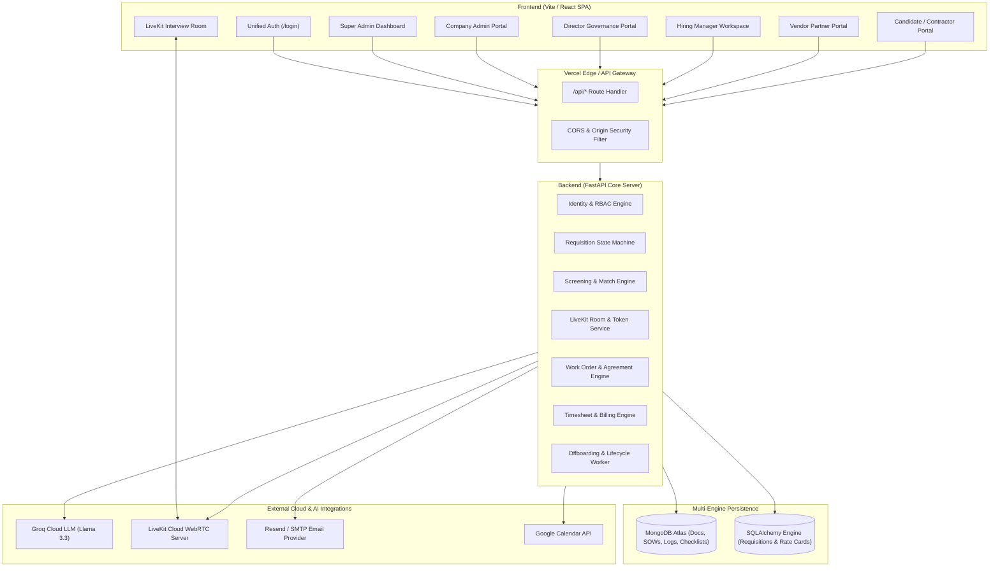

---

## 2. Multi-Tenant Onboarding & RBAC Ecosystem

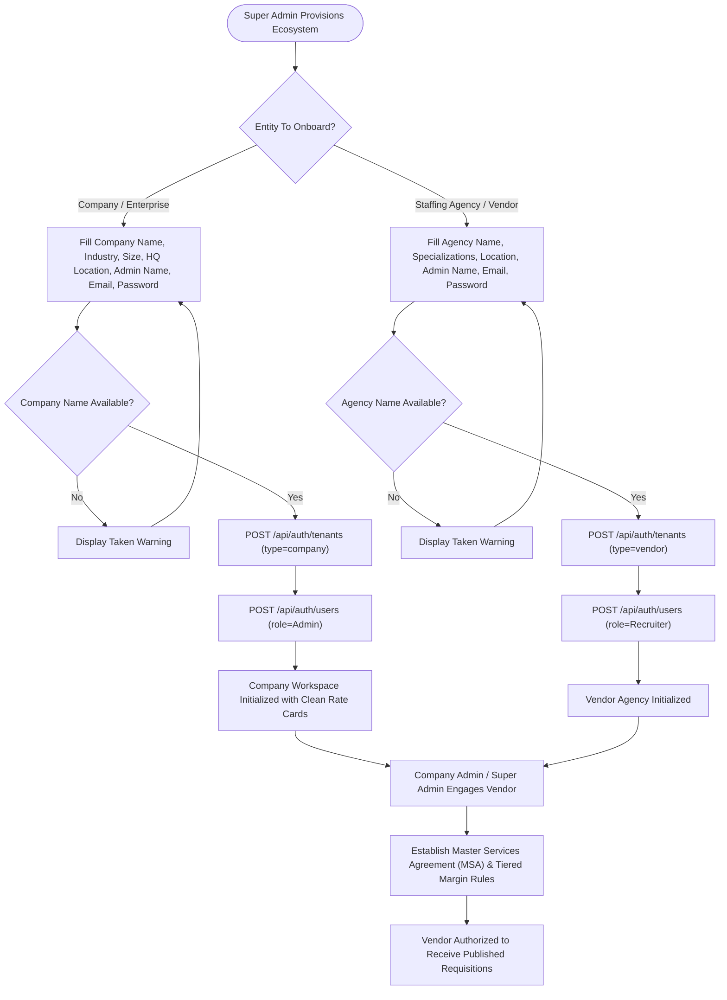

---

## 3. Unified Authentication & Dynamic Route Guarding

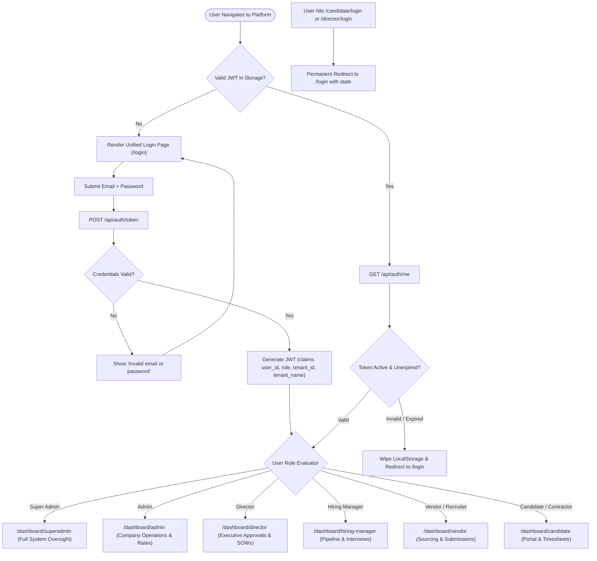

---

## 4. Job Requisition Lifecycle & Director Governance Flowchart

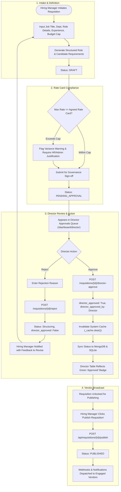

---

## 5. Vendor Candidate Sourcing & Duplicate Prevention Flowchart

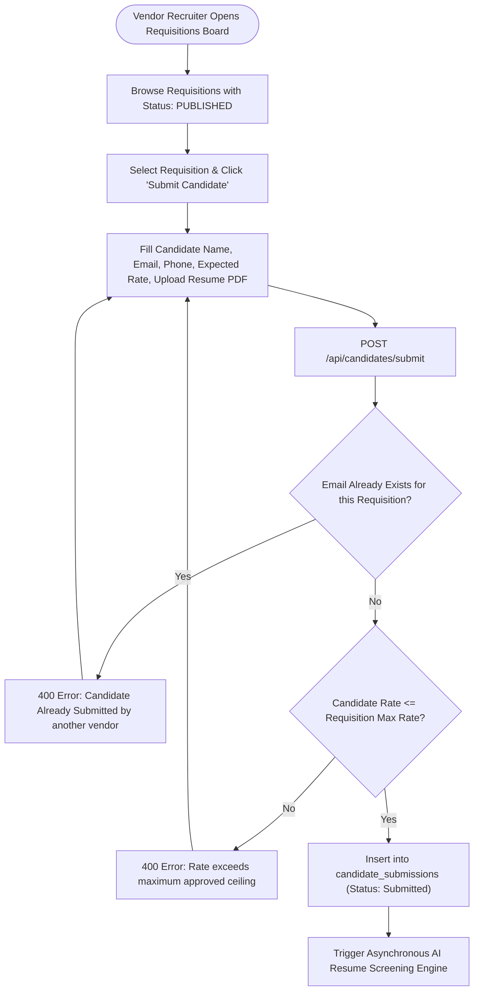

---

## 6. AI Resume Screening & Semantic Scoring Engine

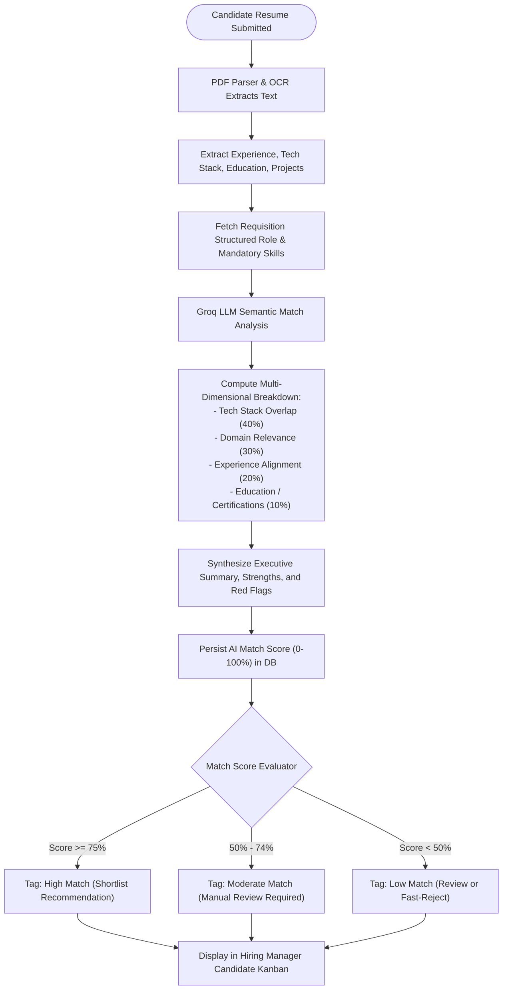

---

## 7. LiveKit AI Video Interview & Evaluation Engine

```mermaid
flowchart TD
    ScheduleStart([Hiring Manager Requests AI Interview]) --> GenRoom["POST /api/interviews/session/create"]
    GenRoom --> CreateLKRoom["LiveKit API Creates Secure WebRTC Room"]
    CreateLKRoom --> GenTokens["Generate Candidate JWT & AI Agent Worker Token"]
    GenTokens --> SendInvite["Email Candidate with Single-Click Interview Link"]

    SendInvite --> CandJoins([Candidate Enters Interview URL])
    CandJoins --> MediaCheck["Browser Requests Camera & Microphone Permissions"]
    MediaCheck --> ConnectLK["Candidate Connects to LiveKit Room via WebRTC"]
    
    ConnectLK --> AgentGreeting["AI Avatar Bot Joins & Greets Candidate"]
    AgentGreeting --> QuestionLoop["Loop: Technical & Behavioral Questions"]

    subgraph RealTime_Interaction ["Real-time Voice & Video Loop"]
        QuestionLoop --> AIBotSpeaks["TTS Engine Speaks Question"]
        AIBotSpeaks --> CandidateAnswers["Candidate Speaks Answer"]
        CandidateAnswers --> SileroVAD["Client-side Silero VAD Detects Speech Boundaries"]
        SileroVAD --> STT["LiveKit Audio Stream Transcribed via STT"]
        STT --> TranscriptLog["Real-time Transcript Buffered into Session"]
        TranscriptLog --> Evaluator["LLM Evaluates Depth & Follow-up Needed"]
        Evaluator --> NextQuestion{More Questions?}
        NextQuestion -->|Yes| QuestionLoop
        NextQuestion -->|No| Conclude["AI Avatar Concludes Interview & Closes Room"]
    end

    Conclude --> GenerateReport["Post-Interview Synthesis:
    - Technical Knowledge Score
    - Problem-solving Rating
    - Communication & Clarity
    - Full Timestamped Transcript"]
    GenerateReport --> SaveInterviewResult["Save to interview_evaluations Collection"]
    SaveInterviewResult --> HMReview["Hiring Manager Reviews Scorecard & Selects Candidate"]
```

---

## 8. Commercial Work Order (SOW) & Multi-Tier Sign-Off Flowchart

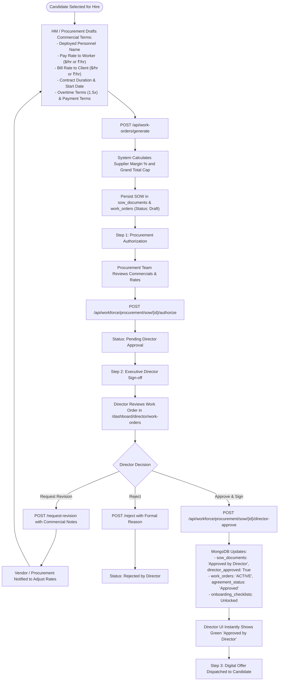

---

## 9. Digital Candidate Onboarding & Activation Gates

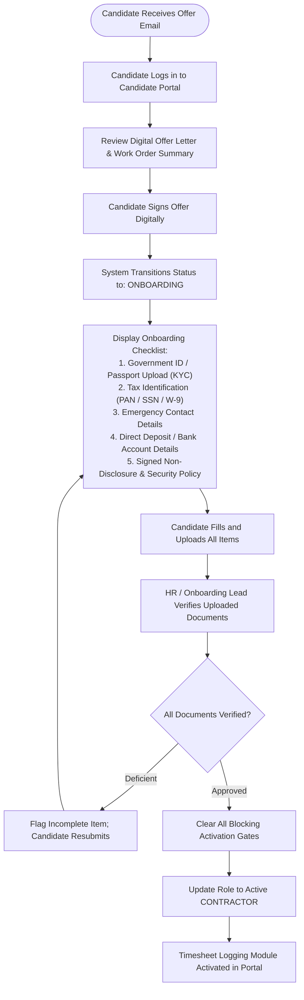

---

## 10. Active Contractor Timesheets, Approvals & Billing Flowchart

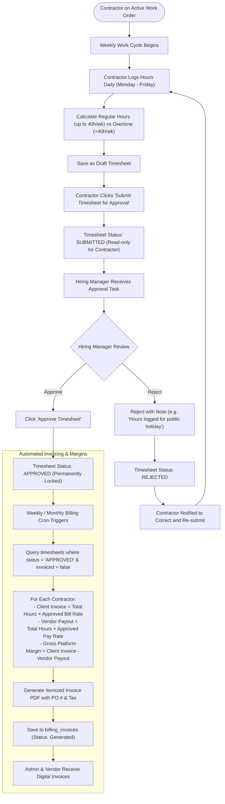

---

## 11. Contractor Offboarding & 48-Hour Deactivation Lifecycle

```mermaid
flowchart TD
    InitiateOffboarding([Hiring Manager Initiates Offboarding]) --> OffboardForm["Select Contractor, Termination Reason (Contract End / Performance / Resignation), Last Working Day"]
    OffboardForm --> POST_InitOffboard["POST /api/offboarding/initiate"]
    
    POST_InitOffboard --> CreateOffboardRecord["Insert into offboarding_records (Status: PENDING_CANDIDATE)"]
    CreateOffboardRecord --> NotifyCandOffboard["Candidate Notified to Complete Exit Verification"]

    NotifyCandOffboard --> CandLogsIn["Candidate Logs in to Portal"]
    CandLogsIn --> ExitChecklist["Candidate Completes Matching Onboarding/Offboarding Checklist:
    - Company Asset Return Acknowledgment
    - Knowledge Transfer Sign-off
    - Security Access Revocation Agreement
    - Final Expense Submission Confirmation"]

    ExitChecklist --> SubmitExit["Candidate Ticks All Items & Submits Exit Checklist"]
    SubmitExit --> POST_CompleteOffboard["POST /api/offboarding/candidate-complete"]

    subgraph State_Freezing_Phase ["Phase 1: Freezing & 48-Hour Grace Period"]
        POST_CompleteOffboard --> FreezeTimesheets["Timesheet Status Updated to: FROZEN (No new entries allowed)"]
        FreezeTimesheets --> SetGracePeriod["Set grace_period_expires_at = NOW + 48 HOURS"]
        SetGracePeriod --> UpdateUserStatus["User is_active remains TRUE for 48 hours with grace banner"]
        UpdateUserStatus --> CandidateBanner["Candidate Sees Banner: 'Account access expires in XX hours. Download tax documents and pay slips.'"]
    end

    subgraph Deactivation_Phase ["Phase 2: Total Deactivation & Email Reuse"]
        CandidateBanner --> ClockTick{"48 Hours Expired?"}
        ClockTick -->|No| ReadOnlyAccess["Candidate Can View Past Timesheets & Download Pay Slips"]
        ClockTick -->|Yes| AutoDeactivateCron["Background Worker: process_expired_offboardings()"]
        
        AutoDeactivateCron --> DisableUser["Set users.is_active = FALSE & is_offboarded = TRUE"]
        DisableUser --> UnblockEmail["Clear / Rename Email Constraint to Allow Re-application (e.g. email_reapplication_enabled=True)"]
        UnblockEmail --> TerminateSessions["Invalidate all Active JWTs & Sessions for User"]
        TerminateSessions --> LoginFails["Subsequent Login Attempts Return: 'Account deactivated.'"]
        LoginFails --> ReapplyAvailable["Vendor Can Now Re-submit This Email for Future Roles"]
    end
```

---

## 12. System State Machine & Database Entity Mapping

### 12.1 Core Entity State Transitions

| Entity | Initial State | Intermediate States | Final State |
| :--- | :--- | :--- | :--- |
| **Requisition** | `Draft` | `Intake` &rarr; `Structuring` &rarr; `PendingApproval` | `Published` / `Closed` |
| **Director Sign-off** | `Unapproved` (`director_approved: False`) | `Under Executive Review` | `Approved` (`director_approved: True`) |
| **Candidate Submission** | `Submitted` | `Screened` &rarr; `Shortlisted` &rarr; `Interviewing` | `Offered` / `Rejected` |
| **Work Order / SOW** | `Draft` | `Pending Procurement` &rarr; `Pending Director Approval` | `Approved by Director` / `ACTIVE` |
| **Candidate Onboarding** | `Pending Offer` | `Offer Signed` &rarr; `KYC Verification` | `Completed` &rarr; `Contractor Activated` |
| **Timesheet** | `Draft` | `Submitted` &rarr; `Under HM Review` | `Approved` (Locked) / `Frozen` (Offboarded) |
| **Contractor Lifecycle** | `Active Contractor` | `Pending Offboarding Checklist` &rarr; `48-Hour Grace Period` | `Deactivated` (Email Re-usable) |

---

### 12.2 Database Storage Architecture

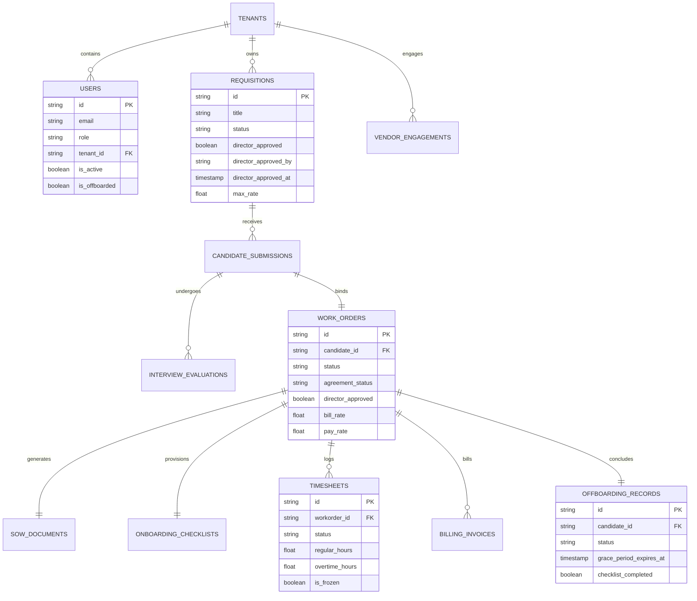

---

## 13. System Governance & Compliance Verification

1. **Multi-Tenant Boundary:** Every API request validates JWT `tenant_id`. No tenant can query or modify another company's requisitions, candidates, or billing documents.
2. **Director Approval Gate:** No requisition can be published to vendors without `director_approved: True`. No Work Order can activate timesheets without Director executive authorization.
3. **Double Submission Prevention:** Candidate email submissions are unique per requisition. Resumes cannot be dual-represented by multiple vendors.
4. **Billing Integrity:** Approved timesheets cannot be edited. Offboarded contractors have their timesheet entry immediately frozen upon exit checklist submission.
5. **Offboarding Compliance:** Contractors retain 48-hour document retrieval access before automated deactivation renders credentials inactive while releasing the email for future engagements.
