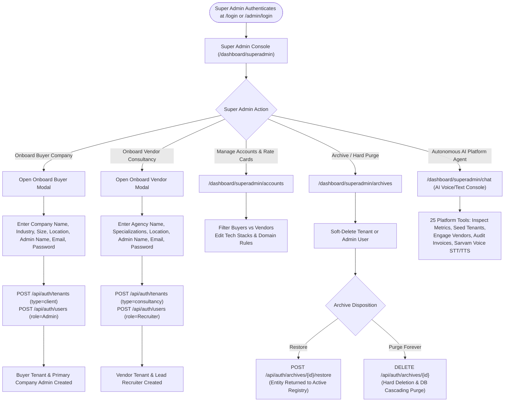
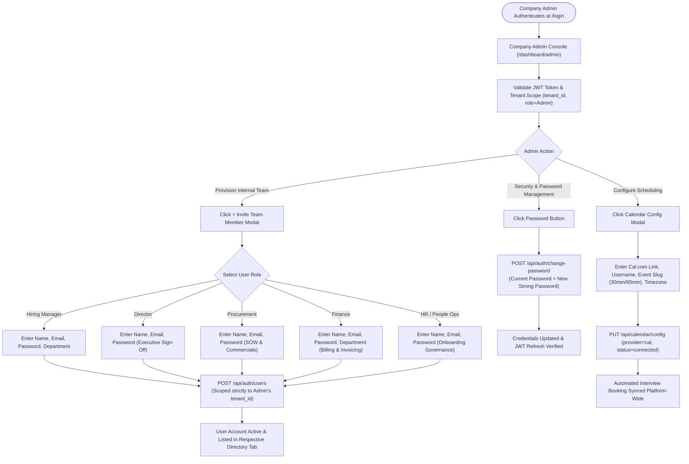
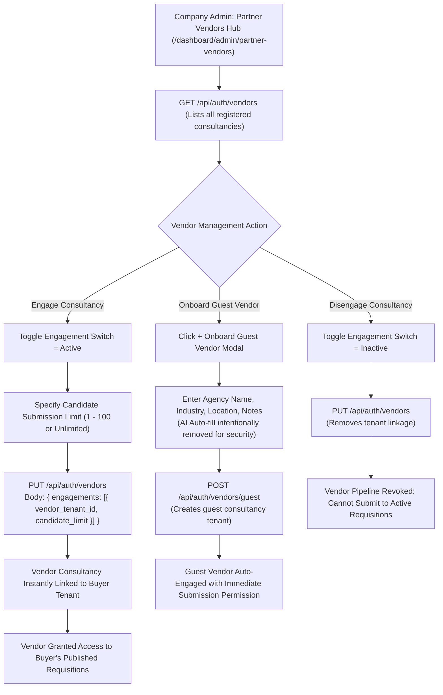
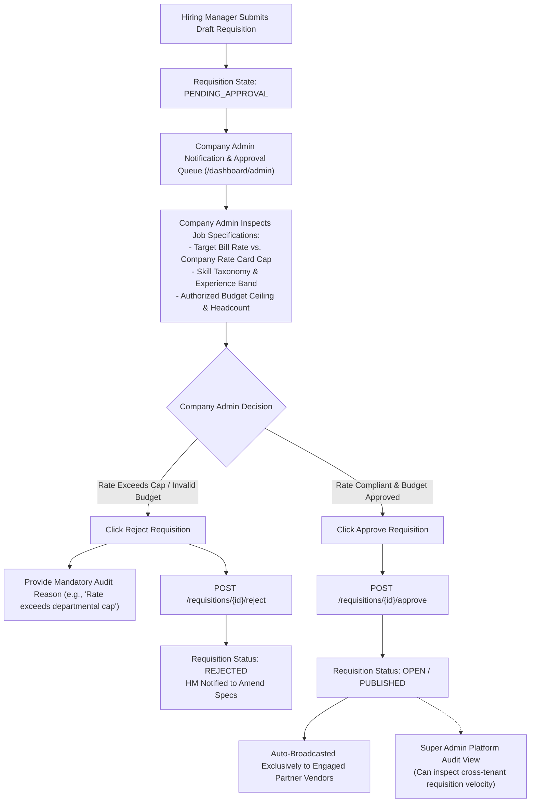
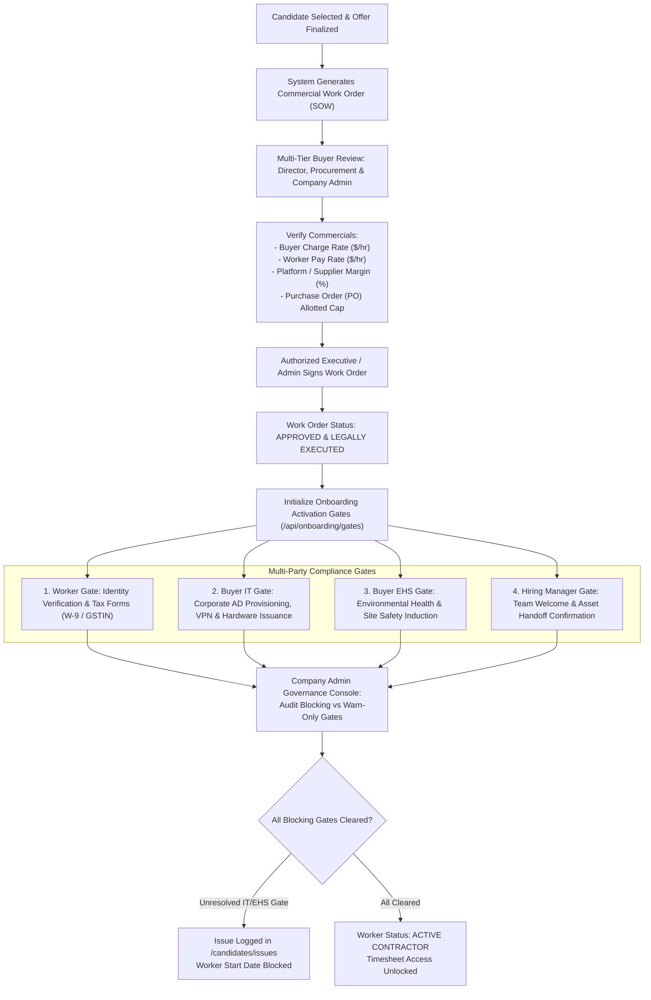
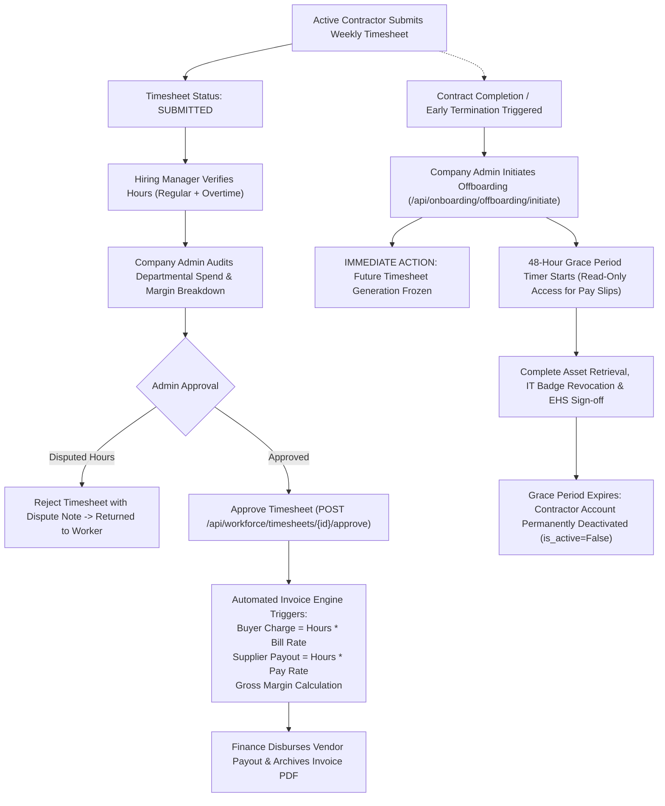

# Term Jobs Platform — Super Admin & Company Admin (Super Buyer & Buyer Enterprise) Unified Workflow Architecture & Test Case Specification

**Document Version:** 1.0  
**Target Roles:** Super Admin (Platform Owner / Super Buyer Operator) & Company Admin (Buyer Enterprise Organization Administrator)  
**System Under Test:** Term Jobs Enterprise Contract Workforce & Vendor Management System (VMS)  
**Date:** September 2026  
**Status:** Approved for QA Execution & Enterprise Operations  

---

## 1. Executive Summary & Architectural Scope

### 1.1 Objective
This specification establishes the end-to-end operational workflows, state transition engines, security boundaries, and comprehensive QA test suites exclusively for the two principal governance authorities of the **Term Jobs** platform:
1. **Super Admin (Platform Owner / Super Buyer Operator):** The sovereign platform controller holding unrestricted cross-tenant oversight, root-level multi-tenant provisioning, tenant archiving and hard purging, global user directory administration, and AI voice/text platform orchestrations.
2. **Company Admin (Buyer Enterprise Organization Administrator):** The enterprise-level authority governing a dedicated client buyer organization (`tenant_type="client"`). Responsible for internal buyer team provisioning (Hiring Managers, Directors, Procurement, Finance, HR), staffing vendor partner engagement and submission caps, requisition approval guardrails, master interview scheduling configurations (Cal.com), work order (SOW) oversight, multi-party onboarding gate clearances (Buyer IT / Buyer EHS), and contractor timesheet/offboarding lifecycles.

```
+-----------------------------------------------------------------------------------------+
|                                    SUPER ADMIN                                          |
|                          (Global Master / Super Buyer)                                  |
|  * Provisions Client Tenants & Vendor Consultancies   * Global System Auditing & Archives|
|  * Manages All Admin & Recruiter Accounts             * 25-Tool AI & Voice Platform Agent|
+-----------------------------------------------------------------------------------------+
                                             │
                       Provisions & Governs  ▼
+-----------------------------------------------------------------------------------------+
|                                   COMPANY ADMIN                                         |
|                          (Buyer Enterprise Tenant Admin)                                |
|  * Internal Team (HM, Director, Procurement, Finance) * Requisition Approval & Rate Caps|
|  * Partner Vendor Sourcing & Candidate Quotas         * SOW, Gate Clearance & Offboard  |
+-----------------------------------------------------------------------------------------+
```

---

## 2. Roles & Permissions (RBAC) Governance Matrix

| Capability / Operational Domain | Super Admin (Super Buyer) | Company Admin (Buyer Enterprise) | Validation Rule / Backend Enforcement |
| :--- | :---: | :---: | :--- |
| **Multi-Tenant Organization Provisioning** | **Full** (Create/Archive/Purge) | **None** | `current_user.role == 'Super Admin'` on `/api/auth/tenants` |
| **Client Buyer Tenant Management** | **Full** (Global Oversight) | **Tenant-Only** (Own Profile) | Scoped to `current_user.tenant_id` for Company Admin |
| **Vendor Consultancy Provisioning** | **Full** (System Registry) | **None** (Guest Vendor Only) | Global provisioning restricted to Super Admin |
| **Company Admin Account Provisioning** | **Full** | **None** | Super Admin provisions `Admin` role via `PROVISION_MATRIX` |
| **Internal Buyer Team Provisioning** | **None** (Delegated to Admin) | **Full** (HM, Dir, Proc, Fin, HR) | Admin provisions internal roles matching tenant scope |
| **Partner Vendor Engagement & Quotas** | **Audit / View All** | **Full** (Engage / Disengage / Caps) | Admin configures vendor limits via `/api/auth/vendors` |
| **Requisition Approval & Rate Caps** | **Global Audit / View** | **Full** (Approve / Reject) | Admin gates `PENDING_APPROVAL` to `OPEN` or `REJECTED` |
| **Interview Scheduling Configuration** | **Global Audit** | **Full** (Cal.com / Webhooks) | Admin manages `/api/calendar/config` for tenant |
| **Work Order / SOW Commercials** | **Audit / Cross-Tenant** | **Full** (Review & Approval Gate) | Admin verifies bill rate, pay rate, margin, and PO cap |
| **Multi-Party Onboarding Gate Clearance** | **Global Oversight** | **Full** (Buyer IT & EHS Sign-off) | Admin monitors `/api/onboarding/gates` & issues |
| **Contractor Timesheets & Expenses** | **Global Spend Audit** | **Full** (Review / Approve / Reject) | Admin audits timesheet totals, overtime & billing |
| **Contractor Offboarding & Grace Period** | **Global Emergency Override** | **Full** (Initiate / Freeze / 48hr) | Admin initiates offboarding; triggers timesheet lock |
| **Tenant Archiving & Permanent Purge** | **Full** (Dedicated `/archives`) | **None** | Destructive purge restricted to Super Admin |
| **Autonomous AI Voice & Text Agent** | **Full** (25 Tools, Voice STT/TTS) | **None** (Platform Agent Restricted) | Authenticated to `/api/superadmin-agent/chat` |

---

## 3. End-to-End Visual Workflow Diagrams

### 3.1 Workflow 1: Super Admin Multi-Tenant Ecosystem Lifecycle



---

### 3.2 Workflow 2: Company Admin Enterprise Setup & Team Provisioning



---

### 3.3 Workflow 3: Buyer-Vendor Partnership & Sourcing Control



---

### 3.4 Workflow 4: Requisition Governance & Financial Rate Guardrails



---

### 3.5 Workflow 5: Work Order (SOW) Oversight & Multi-Party Activation Gates



---

### 3.6 Workflow 6: Active Contractor Timesheet, Billing & Offboarding Governance



---

## 4. Comprehensive QA Test Suites for Super Admin & Company Admin

---

### Test Suite 1: Super Admin Authentication & Platform Console Oversight

| Test ID | Test Case Title | Role | Pre-conditions | Test Steps | Expected Result | Priority |
| :--- | :--- | :---: | :--- | :--- | :--- | :---: |
| **TC-SA-AUTH-01** | Dedicated Super Admin Login via `/admin/login` | Super Admin | Super Admin record exists in database | 1. Navigate to `/admin/login`<br>2. Enter Super Admin email & password<br>3. Submit form | JWT issued with `role: "Super Admin"`; redirected to `/dashboard/superadmin` | **P0** |
| **TC-SA-AUTH-02** | Unified Auth Page Login with Role Interception | Super Admin | Super Admin user credentials ready | 1. Navigate to unified `/login`<br>2. Enter email (`admin@termjobs.com`) & password<br>3. Click "Sign In" | Backend resolves Super Admin role; user redirected directly to `/dashboard/superadmin` | **P0** |
| **TC-SA-AUTH-03** | Super Admin Token Refresh & Expiry Handshake | Super Admin | Logged in as Super Admin | 1. Verify localStorage `token` contains valid claims<br>2. Allow token to expire or pass corrupted header<br>3. Perform request to `/api/auth/tenants` | Request rejected with `401 Unauthorized`; app redirects to `/login` | **P1** |
| **TC-SA-DASH-01** | Platform Metrics Dashboard Aggregation | Super Admin | Multiple buyers, vendors, and admins seeded | 1. Open `/dashboard/superadmin`<br>2. Inspect Metric Cards: Companies, Admin Accounts, Active Pipelines | Metric cards render actual DB counts matching `client_tenants`, `consultancy_tenants`, and `admin_accounts` | **P0** |
| **TC-SA-DASH-02** | Platform Live Activity Feed Parsing | Super Admin | Recent tenant and user onboarding actions performed | 1. Inspect "Platform Activity" stream on dashboard<br>2. Check latest entries | Correct dynamic cards display: "Buyer company onboarded", "Vendor consultancy onboarded", "Company admin updated" | **P1** |

---

### Test Suite 2: Super Admin Multi-Tenant Provisioning & Tenant Lifecycle

| Test ID | Test Case Title | Role | Pre-conditions | Test Steps | Expected Result | Priority |
| :--- | :--- | :---: | :--- | :--- | :--- | :---: |
| **TC-SA-ONB-01** | Provision Client Buyer Company Tenant | Super Admin | Super Admin logged in | 1. Click "+ Onboard Buyer Company" on dashboard<br>2. Enter Name: "Stark Enterprises", Industry: "Manufacturing", Size: "10,000+", HQ: "Austin, TX"<br>3. Enter Primary Admin Name, Email, and Password<br>4. Click "Create Company" | API creates tenant record with `tenant_type="client"`, provisions `Admin` user with `tenant_id`, displays success toast, and refreshes directory | **P0** |
| **TC-SA-ONB-02** | Provision Staffing Vendor Consultancy Tenant | Super Admin | Super Admin logged in | 1. Click "+ Onboard Vendor" button<br>2. Enter Agency Name: "Apex Tech Staffing", Specializations: "Fullstack, AI, DevOps", Location: "San Jose, CA"<br>3. Enter Admin Name, Email, and Password<br>4. Click "Create Vendor" | API creates tenant record with `tenant_type="consultancy"`, provisions `Recruiter` user, and displays in vendor directory | **P0** |
| **TC-SA-ONB-03** | AI Auto-Fill Removal Verification (Security Policy) | Super Admin | Super Admin logged in | 1. Open Onboard Company Modal<br>2. Open Onboard Vendor Modal<br>3. Inspect DOM and network tab | No "Auto-fill with AI" button, banner, or Groq API triggers exist; manual validation enforced | **P0** |
| **TC-SA-ONB-04** | Duplicate Tenant Organization Validation | Super Admin | "Acme Corp" exists as client tenant | 1. Open Onboard Company Modal<br>2. Enter "Acme Corp"<br>3. Inspect inline response | System raises duplicate tenant error; submit button blocked; error toast rendered | **P1** |
| **TC-SA-ARCH-01** | Soft-Delete / Archive Buyer Organization | Super Admin | Active buyer company exists with users | 1. Navigate to `/dashboard/superadmin/accounts`<br>2. Locate test company<br>3. Click "Archive Company" & confirm prompt | `DELETE /api/auth/tenants/{id}` soft-deletes tenant (`is_active=False`); moved to Archives; hidden from standard directory | **P0** |
| **TC-SA-ARCH-02** | Restore Soft-Deleted Organization | Super Admin | Archived company exists in `/archives` | 1. Navigate to `/dashboard/superadmin/archives`<br>2. Locate archived tenant<br>3. Click "Restore Organization" | `POST /api/auth/archives/{id}/restore` reactivates tenant and associated users; appears in active tables | **P0** |
| **TC-SA-ARCH-03** | Permanent Hard-Purge of Archived Tenant | Super Admin | Archived company in `/archives` | 1. Locate archived tenant<br>2. Click "Permanently Purge"<br>3. Confirm secondary warning dialogue | `DELETE /api/auth/archives/{id}` permanently deletes record and all cascade references from MongoDB and SQL | **P0** |

---

### Test Suite 3: Super Admin User Governance & Admin Account Management

| Test ID | Test Case Title | Role | Pre-conditions | Test Steps | Expected Result | Priority |
| :--- | :--- | :---: | :--- | :--- | :--- | :---: |
| **TC-SA-USR-01** | Global Administrator Directory Visibility | Super Admin | Multiple buyer admins and vendor recruiters exist | 1. Navigate to `/dashboard/superadmin/admin-accounts`<br>2. Toggle filters: "All Admins", "Company Admins", "Vendor Admins" | Table displays every admin account across all tenants with name, email, tenant name, role, and active status | **P0** |
| **TC-SA-USR-02** | Update Company Admin Attributes | Super Admin | Existing Company Admin account | 1. Click "Edit" on Company Admin row<br>2. Update name or email address<br>3. Submit update | `PATCH /api/auth/users/{user_id}` persists updates; cache invalidated; table reflects updated attributes | **P1** |
| **TC-SA-USR-03** | Deactivate / Suspend Company Admin | Super Admin | Active Company Admin | 1. Toggle Active status switch to Inactive<br>2. Confirm deactivation prompt | Admin account marked `is_active=False`; target Admin immediately blocked from logging in with 401 | **P0** |
| **TC-SA-USR-04** | Cross-Tenant Rate Card & Template Oversight | Super Admin | Company profile templates exist | 1. Navigate to Global Accounts configuration<br>2. Inspect shared requisition templates and rate cards | Super Admin can inspect shared platform templates without tenant restrictions | **P1** |

---

### Test Suite 4: Super Admin AI Assistant & Voice/Text Operations

| Test ID | Test Case Title | Role | Pre-conditions | Test Steps | Expected Result | Priority |
| :--- | :--- | :---: | :--- | :--- | :--- | :---: |
| **TC-SA-AI-01** | AI Voice & Text Platform Controller Initialization | Super Admin | Valid Super Admin session | 1. Navigate to `/dashboard/superadmin/chat`<br>2. Verify chat interface renders with system diagnostics | AI Assistant initializes with access to 25 operational tools and system prompt loaded | **P0** |
| **TC-SA-AI-02** | AI Query Platform Metrics & Tenant Breakdown | Super Admin | Tenants and requisitions seeded | 1. Send text: "What are the total active buyer companies and requisitions?"<br>2. Submit query | Agent calls `get_platform_metrics` tool and returns formatted markdown breakdown with accurate counts | **P0** |
| **TC-SA-AI-03** | AI Autonomous Tenant Draft Card Generation | Super Admin | Super Admin in chat | 1. Send text: "Draft onboarding for buyer Cyberdyne Systems in robotics"<br>2. Inspect response | Agent invokes `create_draft_tenant_card` and renders interactive draft form card in chat with preview | **P1** |
| **TC-SA-AI-04** | Voice STT & TTS Pipeline Execution | Super Admin | Microphone permission granted | 1. Click Voice Input button<br>2. Speak: "List all engaged vendor partners"<br>3. Wait for response | Audio sent to `/api/voice/stt`; transcription passed to agent; voice synthesized via `/api/voice/tts` and played | **P1** |

---

### Test Suite 5: Company Admin Authentication & Workspace Console

| Test ID | Test Case Title | Role | Pre-conditions | Test Steps | Expected Result | Priority |
| :--- | :--- | :---: | :--- | :--- | :--- | :---: |
| **TC-CA-AUTH-01** | Company Admin Authentication via `/login` | Company Admin | Company Admin credentials provisioned | 1. Navigate to `/login`<br>2. Enter Company Admin email & password<br>3. Submit | JWT issued with `role: "Admin"` & `tenant_id`; redirected to `/dashboard/admin` | **P0** |
| **TC-CA-AUTH-02** | Tenant Scoping & Branding Validation | Company Admin | Admin belongs to "Bearitt Inc" | 1. Inspect top navigation banner and brand mark<br>2. Verify header displays tenant name | Workspace displays "Bearitt Inc Admin Console" with correct initial avatar and tenant context | **P0** |
| **TC-CA-DASH-01** | Company Dashboard Metric Counters | Company Admin | Hiring Managers, Directors, Requisitions exist in tenant | 1. Open `/dashboard/admin`<br>2. Inspect 6 stat cards: Hiring Managers, Directors, Procurement, Finance, Requisitions, Pending Approval | Accurate real-time counts displayed for Admin's tenant only; zero leakage of other tenants' counts | **P0** |
| **TC-CA-DASH-02** | Password Modification Security Workflow | Company Admin | Admin logged in | 1. Click "Password" button on header<br>2. Enter current password and new valid password<br>3. Submit modal | `POST /api/auth/change-password` updates hash; success toast displayed for 2 seconds; modal closes | **P1** |

---

### Test Suite 6: Company Admin Team Provisioning & Department RBAC

| Test ID | Test Case Title | Role | Pre-conditions | Test Steps | Expected Result | Priority |
| :--- | :--- | :---: | :--- | :--- | :--- | :---: |
| **TC-CA-TEAM-01** | Provision Hiring Manager Account | Company Admin | Admin on `/dashboard/admin` | 1. Click "+ Invite Team Member"<br>2. Select Role: "Hiring Manager"<br>3. Enter Name, Email, Password, Department ("Engineering")<br>4. Submit form | User created with `role="Hiring Manager"`, assigned Admin's `tenant_id`, appears in "Hiring Managers" tab | **P0** |
| **TC-CA-TEAM-02** | Provision Director Account | Company Admin | Admin on `/dashboard/admin` | 1. Open Invite Modal<br>2. Select Role: "Director"<br>3. Enter Name, Email, Password<br>4. Submit form | User created with `role="Director"`; appears in "Directors" tab with executive sign-off authority | **P0** |
| **TC-CA-TEAM-03** | Provision Procurement Team Account | Company Admin | Admin on `/dashboard/admin` | 1. Open Invite Modal<br>2. Select Role: "Procurement"<br>3. Enter Name, Email, Password<br>4. Submit form | User created with `role="Procurement"`; granted access to SOW and Commercial rate governance | **P0** |
| **TC-CA-TEAM-04** | Provision Finance Team Account | Company Admin | Admin on `/dashboard/admin` | 1. Open Invite Modal<br>2. Select Role: "Finance"<br>3. Enter Name, Email, Password, Department ("Accounts Payable")<br>4. Submit form | User created with `role="Finance"`; granted access to `/dashboard/finance` and payment queues | **P0** |
| **TC-CA-TEAM-05** | Unauthorized Role Provisioning Attempt (Privilege Escalation) | Company Admin | Admin token active | 1. Send POST request to `/api/auth/users` with `role="Super Admin"` or `role="Admin"`<br>2. Inspect API response | Rejected with `403 Forbidden: Admin may only provision: Hiring Manager, Director, HR, Procurement, Finance` | **P0** |
| **TC-CA-TEAM-06** | Dedicated Department Management Views | Company Admin | Team members provisioned | 1. Navigate to `/dashboard/admin/hiring-managers`<br>2. Navigate to `/dashboard/admin/directors`<br>3. Navigate to `/dashboard/admin/procurement`<br>4. Navigate to `/dashboard/admin/finance` | Each dedicated sub-page correctly filters and renders only users belonging to that role category | **P1** |

---

### Test Suite 7: Company Admin Partner Vendor Engagement & Submission Limits

| Test ID | Test Case Title | Role | Pre-conditions | Test Steps | Expected Result | Priority |
| :--- | :--- | :---: | :--- | :--- | :--- | :---: |
| **TC-CA-VEND-01** | View Vendor Registry & Engagement Status | Company Admin | Global vendor consultancies exist | 1. Navigate to `/dashboard/admin/partner-vendors`<br>2. Inspect list of available vendor consultancies | Table lists all registered vendors; indicates which are currently `Engaged` with badge and toggle switch | **P0** |
| **TC-CA-VEND-02** | Engage Vendor Consultancy with Candidate Quota | Company Admin | Unengaged vendor in table | 1. Toggle switch to "Engage"<br>2. Enter candidate submission limit: "5"<br>3. Click Save / Confirm | `PUT /api/auth/vendors` links vendor to tenant; quota set to 5; vendor can now view and submit to open jobs | **P0** |
| **TC-CA-VEND-03** | Disengage Vendor Consultancy | Company Admin | Engaged vendor partner | 1. Toggle switch to "Disengage"<br>2. Confirm disengagement prompt | Vendor linkage removed; vendor immediately blocked from submitting candidates to buyer's jobs | **P0** |
| **TC-CA-VEND-04** | Onboard Guest Vendor Agency | Company Admin | Admin on Partner Vendors view | 1. Click "+ Onboard Guest Vendor"<br>2. Enter Agency Name: "Quantum Recruiters", Industry: "Cloud", Location: "Austin"<br>3. Submit modal | Guest vendor tenant created with `is_guest=True`; automatically engaged with buyer tenant | **P1** |
| **TC-CA-VEND-05** | Candidate Submission Limit Enforcement Verification | Company Admin & Vendor | Limit set to 3 for Vendor A | 1. Vendor A submits 3 candidates against requisition<br>2. Vendor A attempts to submit 4th candidate | 4th submission rejected with `400 Bad Request: Candidate submission limit reached for this vendor` | **P0** |

---

### Test Suite 8: Company Admin Interview Scheduling & Cal.com Integration

| Test ID | Test Case Title | Role | Pre-conditions | Test Steps | Expected Result | Priority |
| :--- | :--- | :---: | :--- | :--- | :--- | :---: |
| **TC-CA-CAL-01** | Configure Master Cal.com Scheduling URL | Company Admin | Cal.com account exists | 1. On `/dashboard/admin`, locate "Cal.com Integration" card<br>2. Click "Configure"<br>3. Enter Cal Link (`https://cal.com/acme-talent`), Username (`acme-talent`), Event Slug (`30min`), Duration (`60`), Timezone (`America/New_York`)<br>4. Save settings | `PUT /api/calendar/config` updates record; card status switches to "Connected" with green badge | **P0** |
| **TC-CA-CAL-02** | Automated Booking Link Injection in Candidate Email | Company Admin | Cal.com connected; candidate shortlisted | 1. Hiring Manager requests interview for candidate<br>2. Inspect sent interview notification / webhook payload | Interview invitation incorporates configured Cal.com URL with automated query parameters | **P1** |
| **TC-CA-CAL-03** | Disconnect / Reset Calendar Integration | Company Admin | Cal.com currently connected | 1. Open Calendar configuration modal<br>2. Clear link or click "Disconnect"<br>3. Save configuration | System falls back to default manual interview scheduling modal; status reverts to "Disconnected" | **P2** |

---

### Test Suite 9: Company Admin Requisition Governance & Rate Guardrails

| Test ID | Test Case Title | Role | Pre-conditions | Test Steps | Expected Result | Priority |
| :--- | :--- | :---: | :--- | :--- | :--- | :---: |
| **TC-CA-REQ-01** | Requisition Pending Approval Queue | Company Admin | Requisitions in `PENDING_APPROVAL` status | 1. Open `/dashboard/admin`<br>2. Inspect "Pending Approval" card and table list | Shows all requisitions submitted by department leads awaiting Admin sign-off with target rate and budget | **P0** |
| **TC-CA-REQ-02** | Approve Requisition & Broadcast to Vendors | Company Admin | Requisition in `PENDING_APPROVAL` | 1. Click "Review" on pending requisition<br>2. Verify hourly bill rate is within budget<br>3. Click "Approve Requisition" | Status updates to `OPEN` / `PUBLISHED`; webhook triggers notification to all engaged vendor partners | **P0** |
| **TC-CA-REQ-03** | Reject Requisition with Audit Reason | Company Admin | Requisition in `PENDING_APPROVAL` | 1. Click "Reject Requisition"<br>2. Enter rejection reason: "Hourly rate exceeds department $95/hr limit"<br>3. Confirm rejection | Status updates to `REJECTED`; requisition locked; creator notified with rejection reason | **P0** |
| **TC-CA-REQ-04** | Rate Card Compliance Ceiling Enforcement | Company Admin | Department rate card has max $120/hr cap | 1. Attempt to approve or edit draft requisition with $150/hr rate<br>2. Submit | System displays inline alert: "Rate exceeds tenant max rate card limit"; requires explicit override or reduction | **P1** |
| **TC-CA-REQ-05** | Closed Requisition Vendor Suppression | Company Admin | Requisition is `COMPLETED` or `CLOSED` | 1. Verify status on closed job<br>2. Check vendor portal view | Requisition moves to "Completed" tab; vendor submission endpoints reject new candidate uploads | **P1** |

---

### Test Suite 10: Work Order (SOW) Oversight & Activation Gates

| Test ID | Test Case Title | Role | Pre-conditions | Test Steps | Expected Result | Priority |
| :--- | :--- | :---: | :--- | :--- | :--- | :---: |
| **TC-WO-GATE-01** | Work Order Commercials Verification | Company Admin | Candidate offer accepted; SOW drafted | 1. Navigate to `/dashboard/director/work-orders` or Admin SOW view<br>2. Audit Bill Rate ($100), Pay Rate ($70), Margin ($30 / 30%), PO Number, Start/End Dates | Commercial terms clearly rendered; margin math matches platform formula exactly | **P0** |
| **TC-WO-GATE-02** | Work Order Multi-Tier Execution Gate | Company Admin | SOW pending signature | 1. Verify signatures from Director, Vendor, and Candidate<br>2. Admin signs/approves execution | SOW status transitions to `APPROVED`; triggers automated activation gate sequence | **P0** |
| **TC-WO-GATE-03** | Multi-Party Activation Gate Monitoring | Company Admin | Worker in onboarding pipeline | 1. Navigate to `/dashboard/candidates/onboarding`<br>2. Inspect 4 compliance gates: Worker, Buyer IT, Buyer EHS, Manager | Clear status indicator for each gate: `pending` vs `cleared`; distinguishes `blocking` vs `warn_only` | **P0** |
| **TC-WO-GATE-04** | Buyer IT Gate Clearance (AD/VPN/Badge) | Company Admin | IT gate in `pending` status | 1. Locate "Access provisioning — AD, VPN, badge"<br>2. Click "Clear Gate" / verify IT clearance | Gate status updates to `cleared`; responsible party recorded as "Buyer IT"; timestamp logged | **P0** |
| **TC-WO-GATE-05** | Buyer EHS Gate Clearance (Safety Induction) | Company Admin | EHS gate in `pending` status | 1. Locate "Site safety induction"<br>2. Record clearance confirmation | Gate status updates to `cleared`; safety certificate linked | **P1** |
| **TC-WO-GATE-06** | Blocking Gate Prevents Worker Start | Company Admin | Worker gate or Buyer IT gate `pending` | 1. Check contractor state before all blocking gates are cleared<br>2. Attempt to submit timesheet as worker | System retains status `Onboarding`; contractor timesheet portal locked until all blocking gates clear | **P0** |

---

### Test Suite 11: Timesheet Approvals, Margin Verification & Billing Spend

| Test ID | Test Case Title | Role | Pre-conditions | Test Steps | Expected Result | Priority |
| :--- | :--- | :---: | :--- | :--- | :--- | :---: |
| **TC-TS-BILL-01** | Weekly Timesheet Review & Admin Approval | Company Admin | Weekly timesheet submitted with 40 hrs | 1. Navigate to `/dashboard/workforce/timesheets`<br>2. Review regular hours, overtime, and work notes<br>3. Click "Approve Timesheet" | `POST /api/workforce/timesheets/{id}/approve` updates status to `APPROVED`; audit log captures approver | **P0** |
| **TC-TS-BILL-02** | Margin Calculation Verification | Company Admin | Charge Rate = $100/hr, Worker Pay = $72/hr, 40 hrs | 1. Inspect billing record generated for approved timesheet | Gross Charge = $4,000.00; Pay Out = $2,880.00; Gross Margin = $1,120.00 (28.0%); math verified | **P0** |
| **TC-TS-BILL-03** | Overtime Rate Multiplier Governance | Company Admin | Worker submitted 40 regular + 5 overtime hours | 1. Inspect overtime rate application (1.5x bill rate: $150/hr)<br>2. Verify total gross bill calculation | Overtime calculated at $150 × 5 = $750; Total Bill = $4,750; correctly itemized | **P1** |
| **TC-TS-BILL-04** | Departmental Workforce Spend Analytics | Company Admin | Multiple approved timesheets across departments | 1. Navigate to Workforce Overview / Spend report<br>2. Filter by Department ("Engineering" vs "Marketing") | Aggregated spend totals match sum of departmental contractor timesheets; charts render correctly | **P1** |

---

### Test Suite 12: Contractor Offboarding Governance & Deactivation

| Test ID | Test Case Title | Role | Pre-conditions | Test Steps | Expected Result | Priority |
| :--- | :--- | :---: | :--- | :--- | :--- | :---: |
| **TC-OFF-GOV-01** | Initiate Contractor Offboarding | Company Admin | Active contractor with active work order | 1. Navigate to Active Contractor profile<br>2. Click "Initiate Offboarding"<br>3. Select Reason: "Contract Completion"<br>4. Confirm initiation | `POST /api/onboarding/offboarding/initiate` updates state to `Offboarding`; initiates exit checklist | **P0** |
| **TC-OFF-GOV-02** | Automatic Timesheet Freezing Verification | Company Admin | Offboarding initiated for contractor | 1. Check contractor timesheet submission UI<br>2. Attempt to log future hours | Future timesheet creation is FROZEN; banner displays "Contractor in offboarding; timesheets locked" | **P0** |
| **TC-OFF-GOV-03** | 48-Hour Grace Period Read-Only Access | Company Admin & Contractor | Offboarding initiated at timestamp T | 1. Inspect database field `access_expires_at`<br>2. Contractor logs in during 48-hour window | `access_expires_at` set to T + 48 hours; contractor can download past pay stubs but cannot log hours | **P0** |
| **TC-OFF-GOV-04** | Grace Period Expiry Account Deactivation | Super Admin & Company Admin | Current time > `access_expires_at` | 1. Contractor attempts to authenticate after 48 hours<br>2. Inspect `/api/identity/router.py` check | Login rejected with `401 Unauthorized: Offboarding grace period expired; account deactivated` | **P0** |
| **TC-OFF-GOV-05** | Asset Retrieval & IT Access Revocation Sign-Off | Company Admin | Exit checklist open | 1. Confirm laptop returned<br>2. Confirm AD/VPN credentials revoked<br>3. Admin signs off exit audit | All exit checklist tasks marked complete; contractor record archived with completed exit audit | **P1** |

---

### Test Suite 13: Tenant Isolation, Boundary Enforcement & Negative Security

| Test ID | Test Case Title | Role | Pre-conditions | Test Steps | Expected Result | Priority |
| :--- | :--- | :---: | :--- | :--- | :--- | :---: |
| **TC-SEC-RBAC-01** | Cross-Tenant Data Isolation (IDOR Requisition Access) | Company Admin | Admin A (Tenant A) and Requisition B (Tenant B) | 1. Authenticate as Admin A<br>2. Send GET request to `/requisitions/{id_belonging_to_B}` | Backend raises `403 Forbidden` ("Tenant mismatch") or `404 Not Found`; zero data leaked | **P0** |
| **TC-SEC-RBAC-02** | Cross-Tenant User Provisioning Prevention | Company Admin | Admin A logged in | 1. Send POST to `/api/auth/users` with body `{"tenant_id": "tenant_B_id", "role": "Hiring Manager"}` | Request rejected with `403 Forbidden`; admin cannot provision accounts outside own `tenant_id` | **P0** |
| **TC-SEC-RBAC-03** | Super Admin Restricted Route Protection | Company Admin | Company Admin token | 1. Send GET request to `/api/auth/archives`<br>2. Send POST to `/api/auth/tenants`<br>3. Send POST to `/api/superadmin-agent/chat` | All requests return `403 Forbidden: Super Admin only`; Company Admin strictly blocked from platform controls | **P0** |
| **TC-SEC-RBAC-04** | Input Sanitization & SQL / Script Injection | Super Admin & Company Admin | Form inputs in Onboarding / Requisitions | 1. Enter `Robert'); DROP TABLE users;--` in Company Name<br>2. Enter `` in notes | Inputs sanitized and escaped by Pydantic and SQLAlchemy; rendered as benign string literals | **P0** |
| **TC-SEC-RBAC-05** | Brute Force Protection & Password Constraints | Both | Login screen | 1. Attempt login with short password (< 4 chars)<br>2. Attempt multiple failed logins | Client and backend enforce minimum length; repeated invalid attempts return 401 | **P1** |

---

## 5. Traceability Matrix: Modules to Endpoints & Test Cases

| Functional Domain | Key API Endpoints | Governing Roles | Primary Test Cases |
| :--- | :--- | :---: | :--- |
| **Tenant Provisioning & Registry** | `POST /api/auth/tenants`<br>`GET /api/auth/tenants`<br>`DELETE /api/auth/tenants/{id}` | Super Admin | TC-SA-ONB-01, TC-SA-ONB-02, TC-SA-ONB-03, TC-SA-ONB-04 |
| **Archive & Purge Governance** | `GET /api/auth/archives`<br>`POST /api/auth/archives/{id}/restore`<br>`DELETE /api/auth/archives/{id}` | Super Admin | TC-SA-ARCH-01, TC-SA-ARCH-02, TC-SA-ARCH-03 |
| **Super Admin AI Orchestration** | `POST /api/superadmin-agent/chat`<br>`POST /api/voice/stt`<br>`POST /api/voice/tts` | Super Admin | TC-SA-AI-01, TC-SA-AI-02, TC-SA-AI-03, TC-SA-AI-04 |
| **Internal Team Provisioning** | `POST /api/auth/users`<br>`GET /api/auth/users`<br>`PATCH /api/auth/users/{id}` | Company Admin | TC-CA-TEAM-01, TC-CA-TEAM-02, TC-CA-TEAM-03, TC-CA-TEAM-04, TC-CA-TEAM-05 |
| **Partner Vendor Management** | `GET /api/auth/vendors`<br>`PUT /api/auth/vendors`<br>`POST /api/auth/vendors/guest` | Company Admin | TC-CA-VEND-01, TC-CA-VEND-02, TC-CA-VEND-03, TC-CA-VEND-04, TC-CA-VEND-05 |
| **Calendar & Scheduling** | `GET /api/calendar/config`<br>`PUT /api/calendar/config` | Company Admin | TC-CA-CAL-01, TC-CA-CAL-02, TC-CA-CAL-03 |
| **Requisition Governance** | `GET /requisitions`<br>`POST /requisitions/{id}/approve`<br>`POST /requisitions/{id}/reject` | Company Admin (Super Admin Audit) | TC-CA-REQ-01, TC-CA-REQ-02, TC-CA-REQ-03, TC-CA-REQ-04, TC-CA-REQ-05 |
| **Work Orders & Activation Gates** | `GET /api/workforce/workorders`<br>`GET /api/onboarding/gates`<br>`POST /api/onboarding/gates/{id}/clear` | Company Admin | TC-WO-GATE-01, TC-WO-GATE-02, TC-WO-GATE-03, TC-WO-GATE-04, TC-WO-GATE-05 |
| **Timesheets, Billing & Margins** | `GET /api/workforce/timesheets`<br>`POST /api/workforce/timesheets/{id}/approve`<br>`GET /api/billing/invoices` | Company Admin (Super Admin Audit) | TC-TS-BILL-01, TC-TS-BILL-02, TC-TS-BILL-03, TC-TS-BILL-04 |
| **Contractor Offboarding** | `POST /api/onboarding/offboarding/initiate`<br>`GET /api/onboarding/offboarding/status` | Company Admin | TC-OFF-GOV-01, TC-OFF-GOV-02, TC-OFF-GOV-03, TC-OFF-GOV-04, TC-OFF-GOV-05 |
| **Security & Isolation** | All Endpoints (JWT Header & Tenant Filter) | Super Admin & Company Admin | TC-SEC-RBAC-01, TC-SEC-RBAC-02, TC-SEC-RBAC-03, TC-SEC-RBAC-04, TC-SEC-RBAC-05 |

---

## 6. QA Execution & Acceptance Sign-Off

### 6.1 Quality Gates for Production Deployment
1. **100% P0 Test Pass Rate:** All P0 test cases for Super Admin and Company Admin must pass without exceptions.
2. **Zero Cross-Tenant Leakage:** Security boundary and IDOR checks (TC-SEC-RBAC-01 through 03) must return zero leaked entities across tenant boundaries.
3. **Billing & Margin Exactitude:** Margin calculations (TC-TS-BILL-02) and overtime multipliers (TC-TS-BILL-03) must have 0% variance between front-end display and database persistence.
4. **Offboarding Grace Period Enforcement:** Automated tests must verify that timesheet generation is frozen immediately upon offboarding initiation, and that account access terminates exactly at `access_expires_at`.

### 6.2 Sign-Off Table

| Approval Role | Reviewer Name | Status | Timestamp |
| :--- | :--- | :---: | :--- |
| **Lead QA Architect** | _______________________ | `[ ] APPROVED  [ ] REJECTED` | ___________________ |
| **Principal Platform Engineer** | _______________________ | `[ ] APPROVED  [ ] REJECTED` | ___________________ |
| **Head of Product / Operations** | _______________________ | `[ ] APPROVED  [ ] REJECTED` | ___________________ |
